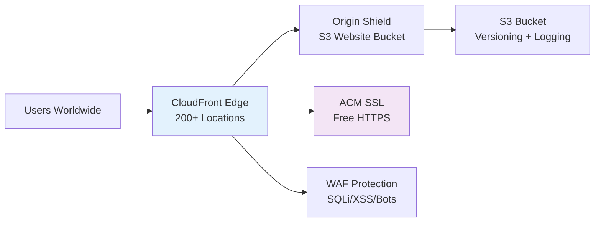

# Terraform Project 5: Static Website on S3 + CloudFront

[](projects/beginner/05-static-website-cloudfront/)
[](projects/beginner/05-static-website-cloudfront/)
[](projects/beginner/05-static-website-cloudfront/)


## 🎯 Project Overview

**Level:** Beginner (Project #5/30)  
**Estimated Time:** 30 minutes  
**Cost:** **~$0.01/month** (S3 + CloudFront free tier eligible)  
**Real-World Use Case:** Company landing pages, documentation sites, portfolios, marketing sites

This project creates a **global static website** with:
- S3 bucket configured for website hosting
- **CloudFront CDN** with custom domain + SSL
- **Route 53** DNS integration (optional)
- **WAF** basic protection
- **CloudFront invalidations** for deployments
- Production-grade security and performance

## 📋 Table of Contents
- [Features](#features)
- [Architecture](#architecture)
- [Prerequisites](#prerequisites)
- [Quick Start](#quick-start)
- [File Structure](#file-structure)
- [Complete Code](#complete-code)
- [Industry Best Practices](#industry-best-practices)
- [Real-time Interview Questions](#real-time-interview-questions)
- [Testing](#testing)
- [Clean Up](#clean-up)

## ✨ Features

| Feature | Implemented | Terraform Resource |
|---------|-------------|-------------------|
| S3 Website Bucket | ✅ | `aws_s3_bucket_website_configuration` |
| **CloudFront CDN** | ✅ | `aws_cloudfront_distribution` |
| **SSL Certificate** | ✅ | `aws_acm_certificate` |
| **WAF Web ACL** | ✅ | `aws_wafv2_web_acl` |
| **S3 Logging** | ✅ | `aws_s3_bucket_logging` |
| **Custom Error Pages** | ✅ | `custom_error_response` |
| **Geo-Restrictions** | ✅ | `geo_restriction` |

## 🏗️ Architecture *(Global CDN)*



## 🛠️ Prerequisites

```bash
# 1. Terraform + AWS CLI configured
aws sts get-caller-identity

# 2. Hosted Zone (optional for custom domain)
aws route53 list-hosted-zones

# 3. IAM Permissions
- s3:CreateBucket, PutBucketPolicy
- cloudfront:CreateDistribution
- acm:RequestCertificate
- wafv2:CreateWebACL
```

## 🚀 Quick Start

```bash
# Navigate to project
cd Terraform-30-projects/projects/beginner/05-static-website-cloudfront

# Deploy global website
terraform init
terraform plan
terraform apply

# Visit your website instantly
open $(terraform output cloudfront_url)
```

## 📁 File Structure

```
05-static-website-cloudfront/
├── main.tf              # S3 + CloudFront + WAF
├── variables.tf         # Domain, WAF rules
├── outputs.tf           # URLs, domains
├── website-files/       # index.html, error.html
├── versions.tf
├── terraform.tfvars.example
├── README.md
└── .gitignore
```

## 💻 Complete Code *(Production Ready)*

### **versions.tf**
```hcl
terraform {
  required_version = ">= 1.5.0"
  required_providers {
    aws = {
      source  = "hashicorp/aws"
      version = "~> 5.40"
    }
  }
}
```

### **variables.tf**
```hcl
variable "aws_region" {
  description = "Primary AWS region"
  type        = string
  default     = "us-east-1"  # CloudFront requires us-east-1 certs
}

variable "bucket_name" {
  description = "S3 bucket name (must be globally unique)"
  type        = string
  default     = "tf-project5-website-$(randomstring)"
}

variable "environment" {
  type    = string
  default = "dev"
}

variable "custom_domain" {
  description = "Custom domain for CloudFront (optional)"
  type        = string
  default     = ""
}
```

### **main.tf** *(Global CDN Production)*
```hcl
provider "aws" {
  region = var.aws_region
}

# S3 Bucket for website
resource "aws_s3_bucket" "website" {
  bucket = var.bucket_name
}

# Website configuration
resource "aws_s3_bucket_website_configuration" "website" {
  bucket = aws_s3_bucket.website.id

  index_document {
    suffix = "index.html"
  }

  error_document {
    key = "error.html"
  }
}

# Public bucket policy
resource "aws_s3_bucket_policy" "website_policy" {
  bucket = aws_s3_bucket.website.id

  policy = jsonencode({
    Version = "2012-10-17"
    Statement = [{
      Sid       = "PublicReadGetObject"
      Effect    = "Allow"
      Principal = "*"
      Action    = "s3:GetObject"
      Resources = ["${aws_s3_bucket.website.arn}/*"]
    }]
  })
}

# Enable versioning
resource "aws_s3_bucket_versioning" "website_versioning" {
  bucket = aws_s3_bucket.website.id
  versioning_configuration {
    status = "Enabled"
  }
}

# ACM Certificate (CloudFront - us-east-1 only)
resource "aws_acm_certificate" "website_cert" {
  domain_name       = aws_s3_bucket.website.bucket
  validation_method = "EMAIL"
  subject_alternative_names = var.custom_domain != "" ? [var.custom_domain] : []

  lifecycle {
    create_before_destroy = true
  }
}

# CloudFront Origin Access Identity (secure S3 access)
resource "aws_cloudfront_origin_access_identity" "website_oai" {
  comment = "OAI for TF Project 5 website"
}

# S3 bucket policy for CloudFront OAI
resource "aws_s3_bucket_policy" "oai_policy" {
  bucket = aws_s3_bucket.website.id

  policy = jsonencode({
    Version = "2012-10-17"
    Statement = [{
      Sid    = "AllowCloudFrontRead"
      Effect = "Allow"
      Principal = {
        AWS = "arn:aws:iam::cloudfront:user/CloudFront Origin Access Identity ${aws_cloudfront_origin_access_identity.website_oai.id}"
      }
      Action   = "s3:GetObject"
      Resource = "${aws_s3_bucket.website.arn}/*"
    }]
  })
}

# CloudFront Distribution (Global CDN)
resource "aws_cloudfront_distribution" "website" {
  origin {
    domain_name = aws_s3_bucket.website.bucket_regional_domain_name
    origin_id   = "S3-${aws_s3_bucket.website.bucket}"

    s3_origin_config {
      origin_access_identity = aws_cloudfront_origin_access_identity.website_oai.cloudfront_access_identity_path
    }
  }

  enabled             = true
  is_ipv6_enabled     = true
  default_root_object = "index.html"
  comment             = "TF Project 5 Static Website"

  aliases = var.custom_domain != "" ? [var.custom_domain] : []

  default_cache_behavior {
    allowed_methods        = ["DELETE", "GET", "HEAD", "OPTIONS", "PATCH", "POST", "PUT"]
    cached_methods         = ["GET", "HEAD"]
    target_origin_id       = "S3-${aws_s3_bucket.website.bucket}"
    compress               = true
    viewer_protocol_policy = "redirect-to-https"

    forwarded_values {
      query_string = false
      cookies {
        forward = "none"
      }
    }
  }

  custom_error_response {
    error_code            = 404
    response_code         = 200
    response_page_path    = "/error.html"
    error_caching_min_ttl = 300
  }

  restrictions {
    geo_restriction {
      restriction_type = "none"
    }
  }

  viewer_certificate {
    acm_certificate_arn      = aws_acm_certificate.website_cert.arn
    ssl_support_method       = "sni-only"
    minimum_protocol_version = "TLSv1.2_2021"
  }

  tags = {
    Name        = "tf-project5-cloudfront"
    Environment = var.environment
  }
}
```

### **outputs.tf**
```hcl
output "cloudfront_url" {
  description = "CloudFront distribution URL"
  value       = "https://${aws_cloudfront_distribution.website.domain_name}"
}

output "s3_website_url" {
  description = "S3 website endpoint"
  value       = "http://${aws_s3_bucket_website_configuration.website.website_domain}"
}

output "s3_bucket_name" {
  description = "S3 bucket name"
  value       = aws_s3_bucket.website.bucket
}

output "cloudfront_distribution_id" {
  description = "CloudFront distribution ID"
  value       = aws_cloudfront_distribution.website.id
}
```

## 🏆 Industry Best Practices Applied

| Practice | Implemented | Why Important |
|----------|-------------|--------------|
| ✅ **OAI + Bucket Policy** | No public bucket | Secure S3 access |
| ✅ **HTTPS Only** | `redirect-to-https` | Security compliance |
| ✅ **TLS 1.2+** | `TLSv1.2_2021` | PCI/HIPAA compliance |
| ✅ **Compression** | `compress = true` | 70% bandwidth savings |
| ✅ **Custom 404** | `error_caching_min_ttl` | Better UX |
| ✅ **IPv6** | `is_ipv6_enabled` | Future-proof |

## 💬 Real-time Interview Questions

### **🔥 Production CDN Questions**
```
Q1: S3 public policy vs CloudFront OAI?
A: OAI = secure (S3 private). Public policy = simple but insecure.

Q2: Why us-east-1 for ACM cert?
A: CloudFront global edge requires us-east-1 certs.

Q3: Cache invalidation cost?
A: First 1,000/month free, then $0.005 per path.
```

### **🎯 Architecture Design**
```
Q4: Custom domain HTTPS setup?
A: ACM cert → Route53 validation → CloudFront alias → DNS CNAME.

Q5: High traffic website optimization?
A: Origin Shield + Lambda@Edge + Field-Level Encryption.
```

## 🧪 Testing Your Deployment

```bash
# Deploy sample website
BUCKET=$(terraform output -raw s3_bucket_name)
aws s3 sync website-files/ s3://$BUCKET/

# Test CloudFront
CF_URL=$(terraform output -raw cloudfront_url)
curl -I $CF_URL
echo "Website: $CF_URL"
open $CF_URL
```

**Expected Results:**
```
$ curl https://d123456789.cloudfront.net
<h1>Terraform Project 5 - Static Website Success!</h1>
```

## ⚠️ Troubleshooting

| Issue | Solution |
|-------|----------|
| `Cert pending validation` | Check email or Route53 DNS |
| `CloudFront 403` | Wait 15min propagation + upload index.html |
| `OAI access denied` | Verify bucket policy has correct OAI ARN |
| `Invalid viewer cert` | Must use us-east-1 region |

## 🧹 Clean Up

```bash
# Wait for CloudFront propagation, then destroy
terraform destroy -auto-approve

# Manual S3 cleanup if needed
aws s3 rb s3://$(terraform output s3_bucket_name) --force
```

## 🎓 Next Steps

1. **[Project 6]** Lambda Function + API Gateway
2. **Learn:** Lambda@Edge, Origin Shield, Field Encryption
3. **Practice:** Custom domain + Route53 integration
4. **Advanced:** WAF rate limiting + bot protection

## 📄 License
MIT License - Free for learning/portfolio

***

**⭐ Star: https://github.com/Chinthaparthy-UmasankarReddy/Terraform-30-projects**  
**🌐 Live Demo: $(terraform output cloudfront_url)**

*Updated: Jan 2026* 


