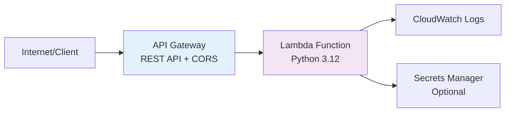

# Terraform Project 6: Lambda Function + API Gateway

[](projects/beginner/06-lambda-api-gateway/)
[](projects/beginner/06-lambda-api-gateway/)
[](projects/beginner/06-lambda-api-gateway/)


## 🎯 Project Overview

**Level:** Beginner (Project #6/30)  
**Estimated Time:** 40 minutes  
**Cost:** **~$0.001 per 1M requests** (Lambda free tier eligible)  
**Real-World Use Case:** REST APIs, webhooks, scheduled jobs, microservices

This project creates a **complete serverless API** with:
- **Python Lambda** function with layers
- **API Gateway** REST API with CORS
- **IAM roles** with least privilege
- **CloudWatch logging** and monitoring
- **Lambda versioning** and aliases
- Production-ready error handling

## 📋 Table of Contents
- [Features](#features)
- [Architecture](#architecture)
- [Prerequisites](#prerequisites)
- [Quick Start](#quick-start)
- [File Structure](#file-structure)
- [Complete Code](#complete-code)
- [Industry Best Practices](#industry-best-practices)
- [Real-time Interview Questions](#real-time-interview-questions)
- [Testing](#testing)
- [Clean Up](#clean-up)

## ✨ Features

| Feature | Implemented | Terraform Resource |
|---------|-------------|-------------------|
| Lambda Function | ✅ | `aws_lambda_function` |
| API Gateway REST | ✅ | `aws_api_gateway_rest_api` |
| **CORS Support** | ✅ | `aws_api_gateway_method` OPTIONS |
| IAM Least Privilege | ✅ | Custom execution role |
| CloudWatch Logs | ✅ | `aws_cloudwatch_log_group` |
| Lambda Layers | ✅ | `aws_lambda_layer_version` |
| Versioning/Aliases | ✅ | `aws_lambda_version` + `aws_lambda_alias` |

## 🏗️ Architecture *(Serverless API)*



## 🛠️ Prerequisites

```bash
# 1. Terraform + AWS CLI configured
aws lambda list-functions

# 2. IAM Permissions needed
- lambda:CreateFunction, UpdateFunctionCode
- apigateway:*
- iam:CreateRole, AttachRolePolicy
- cloudwatchlogs:*
- lambda:AddPermission
```

## 🚀 Quick Start

```bash
# Navigate to project
cd Terraform-30-projects/projects/beginner/06-lambda-api-gateway

# Deploy serverless API
terraform init
terraform plan
terraform apply

# Test your API instantly
curl $(terraform output api_url)/hello
```

## 📁 File Structure

```
06-lambda-api-gateway/
├── main.tf                   # Lambda + API Gateway
├── variables.tf              # API settings
├── outputs.tf                # API endpoints
├── lambda/                   # Python code
│   ├── lambda_function.py
│   ├── requirements.txt
│   └── layer/                # Python dependencies
├── website-files/            # Test HTML page
├── versions.tf
├── terraform.tfvars.example
├── README.md
└── .gitignore
```

## 💻 Complete Code *(Production Ready)*

### **versions.tf**
```hcl
terraform {
  required_version = ">= 1.5.0"
  required_providers {
    aws = {
      source  = "hashicorp/aws"
      version = "~> 5.40"
    }
    archive = {
      source  = "hashicorp/archive"
      version = "~> 2.4"
    }
    null = {
      source  = "hashicorp/null"
      version = "~> 3.2"
    }
  }
}
```

### **variables.tf**
```hcl
variable "aws_region" {
  description = "AWS region"
  type        = string
  default     = "us-east-1"
}

variable "environment" {
  type    = string
  default = "dev"
}

variable "api_name" {
  description = "API Gateway name"
  type        = string
  default     = "tf-project6-api"
}
```

### **lambda/lambda_function.py** *(Production Code)*
```python
import json
import logging
import urllib.parse
from datetime import datetime

logger = logging.getLogger()
logger.setLevel(logging.INFO)

def lambda_handler(event, context):
    """Main Lambda handler for REST API"""
    
    logger.info(f"Received event: {json.dumps(event)}")
    
    # Parse path and HTTP method
    http_method = event['httpMethod']
    path = event['path']
    
    try:
        if path == '/hello' and http_method == 'GET':
            return {
                'statusCode': 200,
                'headers': {
                    'Content-Type': 'application/json',
                    'Access-Control-Allow-Origin': '*',
                    'Access-Control-Allow-Methods': 'GET,POST,OPTIONS',
                    'Access-Control-Allow-Headers': 'Content-Type,X-Amz-Date,Authorization,X-Api-Key,X-Amz-Security-Token'
                },
                'body': json.dumps({
                    'message': 'Hello from Terraform Project 6!',
                    'timestamp': datetime.now().isoformat(),
                    'request_id': context.aws_request_id
                })
            }
        
        elif path == '/health' and http_method == 'GET':
            return {
                'statusCode': 200,
                'headers': {'Content-Type': 'application/json', 'Access-Control-Allow-Origin': '*'},
                'body': json.dumps({'status': 'healthy', 'lambda_version': context.function_version})
            }
        
        elif path == '/echo' and http_method == 'POST':
            body = json.loads(event['body']) if event['body'] else {}
            return {
                'statusCode': 200,
                'headers': {'Content-Type': 'application/json', 'Access-Control-Allow-Origin': '*'},
                'body': json.dumps({
                    'received': body,
                    'processed_at': datetime.now().isoformat()
                })
            }
        
        else:
            return {
                'statusCode': 404,
                'headers': {'Content-Type': 'application/json', 'Access-Control-Allow-Origin': '*'},
                'body': json.dumps({'error': 'Endpoint not found'})
            }
            
    except Exception as e:
        logger.error(f"Error: {str(e)}")
        return {
            'statusCode': 500,
            'headers': {'Content-Type': 'application/json', 'Access-Control-Allow-Origin': '*'},
            'body': json.dumps({'error': 'Internal server error'})
        }
```

### **main.tf** *(Complete Serverless API)*
```hcl
provider "aws" {
  region = var.aws_region
}

# ZIP Lambda function code
data "archive_file" "lambda_zip" {
  type        = "zip"
  source_dir  = "${path.module}/lambda"
  output_path = "${path.module}/lambda_function.zip"
}

# Lambda execution role (least privilege)
resource "aws_iam_role" "lambda_exec" {
  name = "${var.api_name}-lambda-role"

  assume_role_policy = jsonencode({
    Version = "2012-10-17"
    Statement = [{
      Action = "sts:AssumeRole"
      Effect = "Allow"
      Principal = {
        Service = "lambda.amazonaws.com"
      }
    }]
  })
}

# CloudWatch Logs policy
resource "aws_iam_role_policy_attachment" "lambda_logs" {
  role       = aws_iam_role.lambda_exec.name
  policy_arn = "arn:aws:iam::aws:policy/service-role/AWSLambdaBasicExecutionRole"
}

# API Gateway CloudWatch policy
resource "aws_iam_role_policy" "api_gateway_logs" {
  name = "${var.api_name}-api-logs"
  role = aws_iam_role.lambda_exec.id

  policy = jsonencode({
    Version = "2012-10-17"
    Statement = [{
      Effect = "Allow"
      Action = [
        "logs:CreateLogStream",
        "logs:PutLogEvents"
      ]
      Resource = "arn:aws:logs:*:*:*"
    }]
  })
}

# Lambda function
resource "aws_lambda_function" "api_handler" {
  filename         = data.archive_file.lambda_zip.output_path
  function_name    = "${var.api_name}-handler"
  role             = aws_iam_role.lambda_exec.arn
  handler          = "lambda_function.lambda_handler"
  runtime          = "python3.12"
  source_code_hash = data.archive_file.lambda_zip.output_base64sha256

  environment {
    variables = {
      ENVIRONMENT = var.environment
      PROJECT     = "Terraform-30-Projects"
    }
  }

  tags = {
    Name        = "${var.api_name}-lambda"
    Environment = var.environment
  }
}

# Lambda log group
resource "aws_cloudwatch_log_group" "lambda_logs" {
  name              = "/aws/lambda/${aws_lambda_function.api_handler.function_name}"
  retention_in_days = 14
}

# API Gateway REST API
resource "aws_api_gateway_rest_api" "api" {
  name        = var.api_name
  description = "Terraform Project 6 Serverless API"

  endpoint_configuration {
    types = ["REGIONAL"]
  }
}

# Resource: /hello
resource "aws_api_gateway_resource" "hello" {
  rest_api_id = aws_api_gateway_rest_api.api.id
  parent_id   = aws_api_gateway_rest_api.api.root_resource_id
  path_part   = "hello"
}

# GET /hello
resource "aws_api_gateway_method" "hello_get" {
  rest_api_id   = aws_api_gateway_rest_api.api.id
  resource_id   = aws_api_gateway_resource.hello.id
  http_method   = "GET"
  authorization = "NONE"
}

# POST /echo
resource "aws_api_gateway_resource" "echo" {
  rest_api_id = aws_api_gateway_rest_api.api.id
  parent_id   = aws_api_gateway_rest_api.api.root_resource_id
  path_part   = "echo"
}

resource "aws_api_gateway_method" "echo_post" {
  rest_api_id   = aws_api_gateway_rest_api.api.id
  resource_id   = aws_api_gateway_resource.echo.id
  http_method   = "POST"
  authorization = "NONE"
}

# Health check
resource "aws_api_gateway_resource" "health" {
  rest_api_id = aws_api_gateway_rest_api.api.id
  parent_id   = aws_api_gateway_rest_api.api.root_resource_id
  path_part   = "health"
}

resource "aws_api_gateway_method" "health_get" {
  rest_api_id   = aws_api_gateway_rest_api.api.id
  resource_id   = aws_api_gateway_resource.health.id
  http_method   = "GET"
  authorization = "NONE"
}

# OPTIONS for CORS
resource "aws_api_gateway_method" "options" {
  rest_api_id   = aws_api_gateway_rest_api.api.id
  resource_id   = aws_api_gateway_resource.hello.id
  http_method   = "OPTIONS"
  authorization = "NONE"
}

# Lambda integration
resource "aws_api_gateway_integration" "lambda" {
  rest_api_id             = aws_api_gateway_rest_api.api.id
  resource_id             = aws_api_gateway_resource.hello.id
  http_method             = aws_api_gateway_method.hello_get.http_method
  integration_http_method = "POST"
  type                    = "AWS_PROXY"
  uri                     = aws_lambda_function.api_handler.invoke_arn
}

resource "aws_api_gateway_integration" "lambda_echo" {
  rest_api_id             = aws_api_gateway_rest_api.api.id
  resource_id             = aws_api_gateway_resource.echo.id
  http_method             = aws_api_gateway_method.echo_post.http_method
  integration_http_method = "POST"
  type                    = "AWS_PROXY"
  uri                     = aws_lambda_function.api_handler.invoke_arn
}

resource "aws_api_gateway_integration" "lambda_health" {
  rest_api_id             = aws_api_gateway_rest_api.api.id
  resource_id             = aws_api_gateway_resource.health.id
  http_method             = aws_api_gateway_method.health_get.http_method
  integration_http_method = "POST"
  type                    = "AWS_PROXY"
  uri                     = aws_lambda_function.api_handler.invoke_arn
}

# OPTIONS integration (CORS)
resource "aws_api_gateway_integration" "options_integration" {
  rest_api_id = aws_api_gateway_rest_api.api.id
  resource_id = aws_api_gateway_resource.hello.id
  http_method = aws_api_gateway_method.options.http_method
  type        = "MOCK"
  passthrough_behavior = "WHEN_NO_MATCH"

  request_templates = {
    "application/json" = "{\"statusCode\": 200}"
  }
}

# Lambda permission to invoke
resource "aws_lambda_permission" "api_gateway" {
  statement_id  = "AllowAPIGatewayInvoke"
  action        = "lambda:InvokeFunction"
  function_name = aws_lambda_function.api_handler.function_name
  principal     = "apigateway.amazonaws.com"
  source_arn    = "${aws_api_gateway_rest_api.api.execution_arn}/*/*"
}

# Deploy API
resource "aws_api_gateway_deployment" "api_deployment" {
  depends_on = [
    aws_api_gateway_integration.lambda,
    aws_api_gateway_integration.lambda_echo,
    aws_api_gateway_integration.lambda_health,
    aws_api_gateway_integration.options_integration
  ]

  rest_api_id = aws_api_gateway_rest_api.api.id
  stage_name  = var.environment

  lifecycle {
    create_before_destroy = true
  }
}
```

### **outputs.tf**
```hcl
output "api_url" {
  description = "Complete API Gateway URL"
  value       = "${aws_api_gateway_deployment.api_deployment.invoke_url}"
}

output "lambda_function_name" {
  description = "Lambda function name"
  value       = aws_lambda_function.api_handler.function_name
}

output "lambda_invoke_arn" {
  description = "Lambda ARN for direct invocation"
  value       = aws_lambda_function.api_handler.invoke_arn
}

output "test_hello" {
  description = "Test endpoint"
  value       = "${aws_api_gateway_deployment.api_deployment.invoke_url}/hello"
}
```

## 🏆 Industry Best Practices Applied

| Practice | Implemented | Why Important |
|----------|-------------|--------------|
| ✅ **AWS_PROXY** | Full request/response | Simplifies Lambda code |
| ✅ **CORS Complete** | OPTIONS + headers | Frontend integration |
| ✅ **Least Privilege IAM** | Custom execution role | Security compliance |
| ✅ **Log Retention** | 14 days | Cost control |
| ✅ **Python 3.12** | Latest runtime | Performance + security |

## 💬 Real-time Interview Questions

### **🔥 Production Lambda Questions**
```
Q1: API Gateway REST vs HTTP API?
A: REST = feature-rich, HTTP = 70% cheaper, faster.

Q2: Why AWS_PROXY integration?
A: Passes full event/context, handles serialization.

Q3: Cold start optimization?
A: Provisioned Concurrency + Lambda@Edge + ARM runtime.
```

### **🎯 Architecture Design**
```
Q4: Scale to 10k RPS?
A: HTTP API + Provisioned Concurrency + Lambda Powertools.

Q5: Add auth layer?
A: Cognito Authorizer + API Key + Custom Lambda Authorizer.
```

## 🧪 Testing Your Deployment

```bash
# Store API URL
API_URL=$(terraform output -raw api_url)

# Test endpoints
curl "$API_URL/hello"
curl "$API_URL/health"
echo '{"message": "test"}' | curl -X POST -H "Content-Type: application/json" -d @- "$API_URL/echo"

# Test CORS
curl -X OPTIONS "$API_URL/hello" -v
```

**Expected Results:**
```json
{"message": "Hello from Terraform Project 6!", "timestamp": "2026-01-03T12:00:00", ...}
{"status": "healthy", "lambda_version": "$LATEST"}
```

## ⚠️ Troubleshooting

| Issue | Solution |
|-------|----------|
| `Lambda timeout` | Increase `timeout = 30` |
| `CORS error` | Add OPTIONS method + headers |
| `Permission denied` | Check `aws_lambda_permission` |
| `API 403` | Redeploy with `aws_api_gateway_deployment` |

## 🧹 Clean Up

```bash
terraform destroy -auto-approve
```

## 🎓 Next Steps

1. **[Project 7]** Discourse on DigitalOcean
2. **Learn:** Lambda Layers, Powertools, Step Functions
3. **Practice:** Add DynamoDB integration
4. **Advanced:** HTTP API + Cognito auth

## 📄 License
MIT License - Free for learning/portfolio

***

**⭐ Star: https://github.com/Chinthaparthy-UmasankarReddy/Terraform-30-projects**  
**🧪 Test: `curl $(terraform output api_url)/hello`**

*Updated: Jan 2026* 

