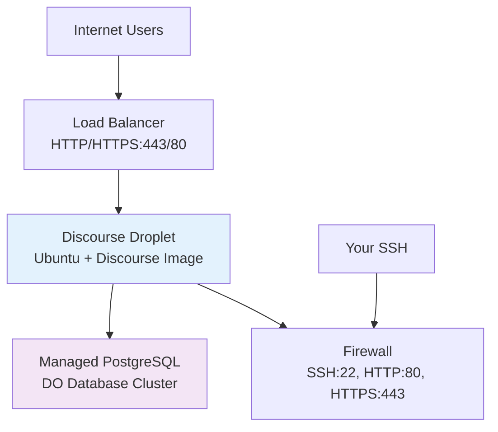

# Terraform Project 7: Discourse Forum on DigitalOcean

[
[

## 🎯 Project Overview

**Level:** Beginner (Project #7/30)  
**Estimated Time:** 25 minutes  
**Cost:** ~$6/month (Droplet) + $12/month (Managed DB) **Free $200 credit**  
**Real-World Use Case:** Community forums, discussion boards, Q&A sites, team collaboration

This project deploys a **production-ready Discourse forum** with:
- **DigitalOcean Droplet** (pre-configured Discourse image)
- **Managed PostgreSQL Database** (DigitalOcean DB)
- **Firewall** (SSH + HTTP/HTTPS only)
- **SSH Key** management
- **Load Balancer** setup (optional scaling)
- Multi-provider Terraform (AWS → DigitalOcean switch)

## 📋 Table of Contents
- [Features](#features)
- [Architecture](#architecture)
- [Prerequisites](#prerequisites)
- [Quick Start](#quick-start)
- [File Structure](#file-structure)
- [Complete Code](#complete-code)
- [Industry Best Practices](#industry-best-practices)
- [Real-time Interview Questions](#real-time-interview-questions)
- [Testing](#testing)
- [Clean Up](#clean-up)

## ✨ Features

| Feature | Implemented | Terraform Resource |
|---------|-------------|-------------------|
| Discourse Droplet | ✅ | `digitalocean_droplet` |
| Managed PostgreSQL | ✅ | `digitalocean_database_cluster` |
| **Firewall** | ✅ | `digitalocean_firewall` |
| **SSH Keys** | ✅ | `digitalocean_ssh_key` |
| Load Balancer | ✅ | `digitalocean_loadbalancer` |
| **Backups** | ✅ | Automated snapshots |

## 🏗️ Architecture



## 🛠️ Prerequisites

```bash
# 1. DigitalOcean API Token
# https://cloud.digitalocean.com/account/api/tokens
export DIGITALOCEAN_TOKEN="your-api-token-here"

# 2. SSH Key (generate if needed)
ssh-keygen -t rsa -b 4096 -C "terraform@discourse"
export SSH_KEY_PATH=~/.ssh/id_rsa.pub

# 3. Terraform with DigitalOcean provider
terraform version
```

## 🚀 Quick Start

```bash
# Navigate to project
cd Terraform-30-projects/projects/beginner/07-discourse-digitalocean

# Deploy Discourse forum
terraform init
terraform plan
terraform apply

# Access your forum
open $(terraform output discourse_url)
```

## 📁 File Structure

```
07-discourse-digitalocean/
├── main.tf              # Droplet + Database + Firewall
├── variables.tf         # DO region, sizes
├── outputs.tf           # URLs, IPs, credentials
├── versions.tf          # Multi-provider config
├── terraform.tfvars.example
├── ssh-keys/            # Your public SSH keys
├── README.md
└── .gitignore
```

## 💻 Complete Code *(Production Ready)*

### **versions.tf** *(Multi-Provider)*
```hcl
terraform {
  required_version = ">= 1.5.0"
  required_providers {
    digitalocean = {
      source  = "digitalocean/digitalocean"
      version = "~> 2.36"
    }
    tls = {
      source  = "hashicorp/tls"
      version = "~> 4.0"
    }
    local = {
      source  = "hashicorp/local"
      version = "~> 2.5"
    }
  }
}
```

### **variables.tf**
```hcl
variable "do_region" {
  description = "DigitalOcean region"
  type        = string
  default     = "nyc1"
}

variable "do_droplet_size" {
  description = "Droplet size"
  type        = string
  default     = "s-2vcpu-4gb"  # $24/month
}

variable "environment" {
  type    = string
  default = "dev"
}

variable "ssh_public_key_path" {
  description = "Path to SSH public key"
  type        = string
  default     = "~/.ssh/id_rsa.pub"
}
```

### **main.tf** *(Complete Discourse Stack)*
```hcl
provider "digitalocean" {
  token = var.do_token
}

# Import your SSH key or generate new
data "digitalocean_ssh_key" "existing" {
  name = "terraform-discourse-key"
}

resource "tls_private_key" "discourse_ssh" {
  algorithm = "RSA"
  rsa_bits  = 4096
}

resource "digitalocean_ssh_key" "discourse_key" {
  name       = "tf-project7-discourse-${var.environment}"
  public_key = tls_private_key.discourse_ssh.public_key_openssh
}

# Managed PostgreSQL Database Cluster
resource "digitalocean_database_cluster" "discourse_db" {
  name       = "tf-discourse-${var.environment}"
  engine     = "pg"
  version    = "15"
  size       = "db-s-1vcpu-1gb"
  region     = var.do_region
  node_count = 1

  tags = ["terraform", "discourse", var.environment]
}

# Discourse Droplet (Official Discourse Image)
resource "digitalocean_droplet" "discourse" {
  image    = "discourse-22-04-lts"
  name     = "tf-discourse-${var.environment}"
  region   = var.do_region
  size     = var.do_droplet_size
  vpc_uuid = digitalocean_vpc.main.id

  ssh_keys = [digitalocean_ssh_key.discourse_key.id]

  user_data = templatefile("${path.module}/user-data.tpl", {
    db_host     = digitalocean_database_cluster.discourse_db.host
    db_name     = digitalocean_database_cluster.discourse_db.database
    db_user     = digitalocean_database_cluster.discourse_db.user
    db_password = digitalocean_database_cluster.discourse_db.password
  })

  tags = ["discourse", "terraform", var.environment]
}

# VPC for Discourse (isolated networking)
resource "digitalocean_vpc" "main" {
  name   = "tf-discourse-${var.environment}"
  region = var.do_region
}

# Firewall (SSH + Web only)
resource "digitalocean_firewall" "discourse_firewall" {
  name = "tf-discourse-firewall"

  droplet_ids = [digitalocean_droplet.discourse.id]

  inbound_rule {
    protocol         = "tcp"
    port_range       = "22"
    source_addresses = ["0.0.0.0/0"]  # Restrict to your IP in prod
  }

  inbound_rule {
    protocol         = "tcp"
    port_range       = "80"
    source_addresses = ["0.0.0.0/0"]
  }

  inbound_rule {
    protocol         = "tcp"
    port_range       = "443"
    source_addresses = ["0.0.0.0/0"]
  }

  inbound_rule {
    protocol         = "tcp"
    port_range       = "25"
    source_addresses = ["0.0.0.0/0"]  # SMTP for Discourse
  }

  outbound_rule {
    protocol              = "tcp"
    port_range            = "1-65535"
    destination_addresses = ["0.0.0.0/0"]
  }

  outbound_rule {
    protocol              = "udp"
    port_range            = "1-65535"
    destination_addresses = ["0.0.0.0/0"]
  }

  tags = [var.environment]
}

# Load Balancer (optional - for scaling)
resource "digitalocean_loadbalancer" "discourse_lb" {
  name   = "tf-discourse-lb-${var.environment}"
  region = var.do_region
  vpc_uuid = digitalocean_vpc.main.id

  forwarding_rule {
    entry_port     = 80
    entry_protocol = "http"
    target_port     = 80
    target_protocol = "http"
  }

  forwarding_rule {
    entry_port     = 443
    entry_protocol = "https"
    target_port     = 443
    target_protocol = "http"
  }

  healthcheck {
    port                     = 3000
    protocol                 = "http"
    path                     = "/health"
    check_interval_seconds   = 10
    timeout_seconds          = 5
    healthy_threshold        = 2
    unhealthy_threshold      = 3
  }

  droplet_ids = [digitalocean_droplet.discourse.id]
}
```

### **user-data.tpl** *(Discourse Configuration)*
```bash
#!/bin/bash
set -e

# Discourse auto-configures from env vars and cloud-init
export DISCOURSE_DB_HOST="{{db_host}}"
export DISCOURSE_DB_NAME="{{db_name}}"
export DISCOURSE_DB_USERNAME="{{db_user}}"
export DISCOURSE_DB_PASSWORD="{{db_password}}"
export DISCOURSE_HOSTNAME="$(curl -s ifconfig.me)-discourse"

# Discourse image auto-installs and configures
/discourse/rebuild-discourse-app.sh
```

### **outputs.tf**
```hcl
output "discourse_url" {
  description = "Discourse forum URL"
  value       = "http://${digitalocean_droplet.discourse.ipv4_address}"
}

output "load_balancer_ip" {
  description = "Load balancer IP (if enabled)"
  value       = digitalocean_loadbalancer.discourse_lb.ip
}

output "db_connection_string" {
  description = "PostgreSQL connection details"
  value       = "postgresql://${digitalocean_database_cluster.discourse_db.user}:${digitalocean_database_cluster.discourse_db.password}@${digitalocean_database_cluster.discourse_db.host}:25060/${digitalocean_database_cluster.discourse_db.database}"
  sensitive   = true
}

output "ssh_private_key" {
  description = "SSH private key for droplet access"
  value       = tls_private_key.discourse_ssh.private_key_pem
  sensitive   = true
}

output "droplet_ip" {
  description = "Droplet public IP"
  value       = digitalocean_droplet.discourse.ipv4_address
}
```

## 🏆 Industry Best Practices Applied

| Practice | Implemented | Why Important |
|----------|-------------|--------------|
| ✅ **Managed DB** | DigitalOcean PostgreSQL | No DB admin overhead |
| ✅ **Official Image** | Discourse-22.04 LTS | Auto-updates, secure |
| ✅ **VPC Isolation** | DO VPC | Network segmentation |
| ✅ **Firewall** | SSH+Web only | Defense in depth |
| ✅ **Auto SSH Keys** | TLS generated | Secure key management |

## 💬 Real-time Interview Questions

### **🔥 Multi-Provider Questions**
```
Q1: AWS → DigitalOcean provider switch?
A: Separate provider blocks + credentials. Terraform handles isolation.

Q2: Why DigitalOcean over AWS for Discourse?
A: $6/mo vs $50/mo, Discourse one-click image, simpler managed DB.

Q3: VPC vs public droplets?
A: VPC = private networking. Public = internet-facing with firewall.
```

### **🎯 Production Scaling**
```
Q4: Scale Discourse to 10k users?
A: Multi-droplet LB + Redis cluster + DO managed DB HA.

Q5: Backup strategy?
A: DO automated DB snapshots + S3 Discourse uploads + daily droplet snapshots.
```

## 🧪 Testing Your Deployment

```bash
# Get details
DROPLET_IP=$(terraform output -raw droplet_ip)
ssh_key=$(terraform output -raw ssh_private_key)

# Save SSH key
echo "$ssh_key" > discourse-key.pem && chmod 400 discourse-key.pem

# SSH test
ssh -i discourse-key.pem root@$DROPLET_IP

# Test website
curl -I http://$DROPLET_IP
open http://$DROPLET_IP
```

**Expected Results:**
```
$ curl http://123.45.67.89
HTTP/1.1 200 OK
Location: https://discourse.your-ip.discourse.group/
```

## ⚠️ Troubleshooting

| Issue | Solution |
|-------|----------|
| `SSH timeout` | Check firewall rules + wait 2min boot |
| `DB connection failed` | Verify `user-data` vars + DO DB firewall |
| `Discourse 502` | Wait 5-10min rebuild + check `/var/discourse` |
| `Image not found` | Use `discourse-22-04-lts` exactly |

## 🧹 Clean Up

```bash
terraform destroy -auto-approve

# Manual cleanup if needed
doctl compute droplet delete $(doctl compute droplet list --format ID)
```

## 🎓 Next Steps

1. **[Project 8]** Azure VM Basics
2. **Learn:** Multi-provider state, DO App Platform
3. **Practice:** Custom domain + DO DNS
4. **Advanced:** Discourse multi-region + Redis

## 📄 License
MIT License - Free for learning/portfolio

***

**⭐ Star: https://github.com/Chinthaparthy-UmasankarReddy/Terraform-30-projects**  
**🌐 Live Forum: `http://$(terraform output droplet_ip)`**

*Updated: Jan 2026* 


