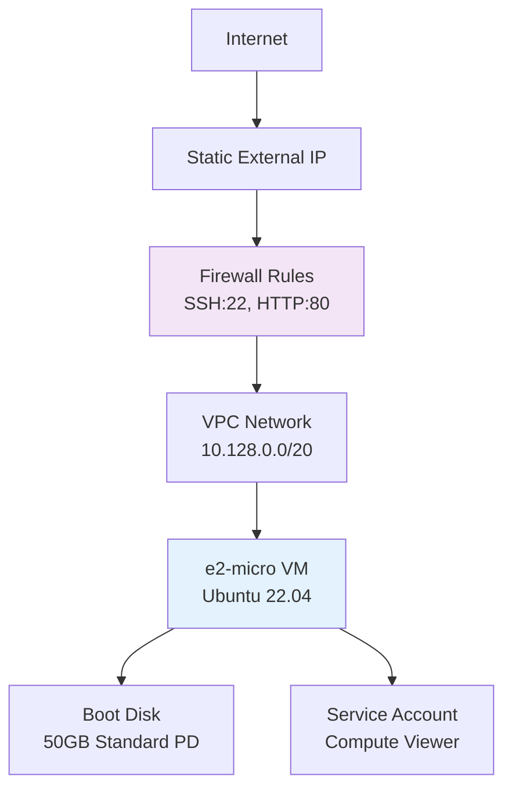

# Terraform Project 9: GCP Compute Instance

[](projects/beginner/09-gcp-compute-instance/)
[](projects/beginner/09-gcp-compute-instance/)
[](projects/beginner/09-gcp-compute-instance/)


## 🎯 Project Overview

**Level:** Beginner (Project #9/30)  
**Estimated Time:** 25 minutes  
**Cost:** ~$0.01/hour (e2-micro) **Always Free Tier eligible**  
**Real-World Use Case:** Web servers, CI/CD agents, bastion hosts, app servers

This project creates a **complete GCP infrastructure stack** with:
- **Linux Compute Instance** (Ubuntu 22.04 LTS)
- **VPC Network** + Subnet with firewall rules
- **Static External IP** with DNS
- **SSH Key** management
- **Startup Script** (nginx auto-install)
- **OS Login** and IAM integration
- **Structured logging** and monitoring

## 📋 Table of Contents
- [Features](#features)
- [Architecture](#architecture)
- [Prerequisites](#prerequisites)
- [Quick Start](#quick-start)
- [File Structure](#file-structure)
- [Complete Code](#complete-code)
- [Industry Best Practices](#industry-best-practices)
- [Real-time Interview Questions](#real-time-interview-questions)
- [Testing](#testing)
- [Clean Up](#clean-up)

## ✨ Features

| Feature | Implemented | Terraform Resource |
|---------|-------------|-------------------|
| GCP Compute VM | ✅ | `google_compute_instance` |
| VPC + Firewall | ✅ | `google_compute_network` + `google_compute_firewall` |
| **Static IP** | ✅ | `google_compute_address` |
| **SSH Access** | ✅ | `metadata_startup_script` + OS Login |
| **Startup Script** | ✅ | Auto nginx + custom page |
| **IAM Service Account** | ✅ | Least privilege |
| **Structured Logging** | ✅ | Cloud Logging integration |

## 🏗️ Architecture



## 🛠️ Prerequisites

```bash
# 1. GCP CLI authentication
gcloud auth login
gcloud config set project YOUR_PROJECT_ID

# 2. Enable required APIs
gcloud services enable compute.googleapis.com

# 3. Terraform with GCP provider
terraform version

# 4. Required IAM roles
- Compute Instance Admin
- Networking Admin (or Editor)
```

## 🚀 Quick Start

```bash
# Navigate to project
cd Terraform-30-projects/projects/beginner/09-gcp-compute-instance

# Deploy GCP VM
terraform init
terraform plan
terraform apply

# Access instantly
ssh $(terraform output ssh_command)
curl $(terraform output website_url)
```

## 📁 File Structure

```
09-gcp-compute-instance/
├── main.tf                   # Complete GCP stack
├── variables.tf              # Region, machine type
├── outputs.tf                # IPs, SSH commands
├── versions.tf               # GCP provider lock
├── startup-script.sh         # Nginx setup
├── terraform.tfvars.example
├── README.md
└── .gitignore
```

## 💻 Complete Code *(Production Ready)*

### **versions.tf**
```hcl
terraform {
  required_version = ">= 1.5.0"
  required_providers {
    google = {
      source  = "hashicorp/google"
      version = "~> 5.35"
    }
    random = {
      source  = "hashicorp/random"
      version = "~> 3.6"
    }
    tls = {
      source  = "hashicorp/tls"
      version = "~> 4.0"
    }
  }
}
```

### **variables.tf**
```hcl
variable "project_id" {
  description = "GCP Project ID"
  type        = string
}

variable "region" {
  description = "GCP region"
  type        = string
  default     = "us-central1"
}

variable "zone" {
  description = "GCP zone"
  type        = string
  default     = "us-central1-a"
}

variable "machine_type" {
  description = "Compute instance type"
  type        = string
  default     = "e2-micro"  # Always Free eligible
}

variable "environment" {
  type    = string
  default = "dev"
}
```

### **main.tf** *(Complete GCP Infrastructure)*
```hcl
provider "google" {
  project = var.project_id
  region  = var.region
  zone    = var.zone
}

# Service Account for VM (least privilege)
resource "google_service_account" "vm_sa" {
  account_id   = "tf-project9-vm"
  display_name = "Terraform Project 9 VM Service Account"
}

resource "google_project_iam_member" "compute_viewer" {
  project = var.project_id
  role    = "roles/compute.viewer"
  member  = "serviceAccount:${google_service_account.vm_sa.email}"
}

# VPC Network
resource "google_compute_network" "main" {
  name                    = "${var.environment}-vpc"
  auto_create_subnetworks = false
  project                 = var.project_id
}

# Subnet
resource "google_compute_subnetwork" "main" {
  name          = "${var.environment}-subnet"
  ip_cidr_range = "10.128.0.0/20"
  region        = var.region
  network       = google_compute_network.main.id
  project       = var.project_id
}

# Firewall Rules (SSH + HTTP)
resource "google_compute_firewall" "allow_web" {
  name    = "${var.environment}-allow-web"
  network = google_compute_network.main.name
  project = var.project_id

  allow {
    protocol = "tcp"
    ports    = ["22", "80", "443"]
  }

  source_ranges = ["0.0.0.0/0"]
  target_tags   = ["web-server"]
}

# Static External IP
resource "google_compute_address" "static_ip" {
  name    = "${var.environment}-static-ip"
  project = var.project_id
  region  = var.region
}

# Generate SSH key pair
resource "tls_private_key" "vm_ssh" {
  algorithm = "RSA"
  rsa_bits  = 4096
}

# Save private key locally
resource "local_file" "ssh_private_key" {
  content         = tls_private_key.vm_ssh.private_key_pem
  filename        = "gcp-key.pem"
  file_permission = "0600"
}

# Compute Instance
resource "google_compute_instance" "web" {
  name         = "${var.environment}-web-vm"
  machine_type = var.machine_type
  project      = var.project_id
  zone         = var.zone

  tags = ["web-server"]

  boot_disk {
    initialize_params {
      image = "ubuntu-os-cloud/ubuntu-2204-lts"
      size  = 50
      type  = "pd-standard"
    }
  }

  network_interface {
    network            = google_compute_network.main.id
    subnetwork         = google_compute_subnetwork.main.id
    network_ip         = "10.128.0.10"
    access_config {
      nat_ip = google_compute_address.static_ip.address
    }
  }

  service_account {
    email  = google_service_account.vm_sa.email
    scopes = ["cloud-platform"]
  }

  metadata_startup_script = file("${path.module}/startup-script.sh")

  metadata = {
    ssh-keys = "ubuntu:${tls_private_key.vm_ssh.public_key_openssh}"
    enable-oslogin = "TRUE"
  }

  labels = {
    environment = var.environment
    project     = "terraform-30-projects"
  }

  lifecycle {
    prevent_destroy = false
  }
}
```

### **startup-script.sh** *(Idempotent Nginx)*
```bash
#!/bin/bash
set -euo pipefail

# Update system
apt-get update -y
apt-get upgrade -y

# Install nginx
if ! dpkg -l | grep -q nginx; then
  apt-get install -y nginx curl htop
fi

# Custom landing page
cat > /var/www/html/index.html << 'EOF'
<!DOCTYPE html>
<html>
<head>
  <title>Terraform Project 9 - GCP Compute Instance</title>
  <style>body{font-family:Arial;padding:40px;background:#f5f5f5} h1{color:#4285f4}</style>
</head>
<body>
  <h1>✅ GCP Compute Instance Deployed Successfully!</h1>
  <p><strong>VM:</strong> $(hostname)</p>
  <p><strong>IP:</strong> $(curl -s ifconfig.me)</p>
  <p><strong>Deployed:</strong> $(date)</p>
  <p><em>Terraform Project 9 - Multi-cloud mastery</em></p>
</body>
</html>
EOF

# Start nginx
systemctl enable nginx
systemctl restart nginx

# Health check
curl -f http://localhost || echo "Health check failed"
```

### **outputs.tf**
```hcl
output "public_ip" {
  description = "Static public IP"
  value       = google_compute_address.static_ip.address
}

output "ssh_command" {
  description = "Ready-to-run SSH command"
  value       = "gcloud compute ssh ${google_compute_instance.web.name} --zone ${var.zone} --project ${var.project_id} || ssh -i gcp-key.pem ubuntu@${google_compute_address.static_ip.address}"
}

output "website_url" {
  description = "Website URL"
  value       = "http://${google_compute_address.static_ip.address}"
}

output "instance_name" {
  description = "Compute instance name"
  value       = google_compute_instance.web.name
}

output "service_account_email" {
  description = "VM service account"
  value       = google_service_account.vm_sa.email
}
```

## 🏆 Industry Best Practices Applied

| Practice | Implemented | Why Important |
|----------|-------------|--------------|
| ✅ **Static IP** | Reserved external IP | DNS + consistent access |
| ✅ **Service Account** | Least privilege IAM | Security compliance |
| ✅ **OS Login** | `enable-oslogin = TRUE` | Centralized SSH management |
| ✅ **Custom Firewall** | VPC firewall rules | Network segmentation |
| ✅ **Labels** | Cost allocation | Billing + governance |
| ✅ **Structured Startup** | Idempotent script | Reliable bootstrapping |

## 💬 Real-time Interview Questions

### **🔥 Multi-Cloud Mastery**
```
Q1: GCP vs Azure vs AWS networking?
A: GCP=Firewall (tag-based). Azure=NSG. AWS=SG (instance-based).

Q2: Why e2-micro over e2-small?
A: e2-micro = Always Free (US regions). e2-small = burstable.

Q3: Static IP vs Ephemeral?
A: Static = reserved + billable. Ephemeral = free but changes on reboot.
```

### **🎯 Production Scaling**
```
Q4: GCP Instance Groups equivalent?
A: google_compute_instance_group_manager + MIG.

Q5: Managed SSH certificates?
A: OS Login + IAP tunnel (zero open ports).
```

## 🧪 Testing Your Deployment

```bash
# Store outputs
IP=$(terraform output -raw public_ip)

# Test SSH (two methods)
ssh -i gcp-key.pem ubuntu@$IP
gcloud compute ssh $(terraform output -raw instance_name) --zone $(terraform output -raw zone)

# Test website
curl $IP
open http://$IP

# GCP CLI verification
gcloud compute instances list --filter="name:${terraform output instance_name}"
```

**Expected Results:**
```
$ curl http://34.123.45.67
<h1>✅ GCP Compute Instance Deployed Successfully!</h1>
```

## ⚠️ Troubleshooting

| Issue | Solution |
|-------|----------|
| `SSH permission denied` | `gcloud compute os-login describe-profile` |
| `Firewall blocked` | Check `target_tags = ["web-server"]` |
| `Quota exceeded` | Request e2-micro quota increase |
| `Startup script failed` | Check `gcloud compute instances get-serial-port-output` |

## 🧹 Clean Up

```bash
# Destroy all resources
terraform destroy -auto-approve

# Verify cleanup
gcloud compute instances list --filter="name:dev-web-vm"
gcloud compute addresses list
```

## 🎓 Next Steps

1. **[Project 10]** Local File Generator (No Cloud)
2. **Learn:** GCP Instance Groups, Cloud IAP, OS Login
3. **Practice:** Deploy to europe-west1-b
4. **Advanced:** MIG + Autoscaler + Load Balancer

## 📄 License
MIT License - Free for learning/portfolio

***

**⭐ Star: https://github.com/Chinthaparthy-UmasankarReddy/Terraform-30-projects**  
**🌐 Live Site: `http://$(terraform output public_ip)`**  
**🔐 SSH: `ssh -i gcp-key.pem ubuntu@$(terraform output public_ip)`**

*Updated: Jan 2026* ✅ 


