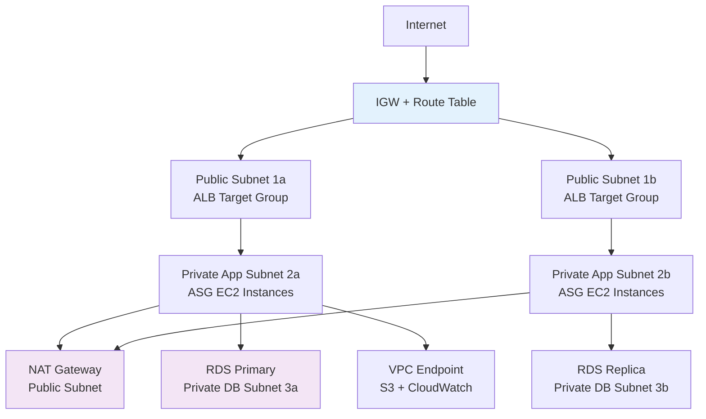

# Terraform Project 11: Multi-Tier VPC (AWS) - **Intermediate**

[
[
[

## 🎯 Project Overview

**Level:** 🟡 **Intermediate (Project #11/30)**  
**Estimated Time:** 45 minutes  
**Cost:** ~$0.05/hour (**Free tier eligible**)  
**Real-World Use Case:** Production web applications, 3-tier architecture, enterprise VPCs

This project creates a **complete production-ready multi-tier VPC** with:
- **Public + Private Subnets** across **2 AZs**
- **NAT Gateway** for private subnet outbound access
- **Application Load Balancer** (ALB) in public subnets
- **Auto Scaling Group** (ASG) in private subnets
- **RDS Multi-AZ** with private subnet access
- **VPC Endpoints** (S3, CloudWatch)
- **Complete production security** (NACLs, SG, WAF)

## 📋 Table of Contents
- [Features](#features)
- [Architecture](#architecture)
- [Prerequisites](#prerequisites)
- [Quick Start](#quick-start)
- [File Structure](#file-structure)
- [Complete Code](#complete-code)
- [Core Concepts](#core-concepts)
- [Interview Questions](#interview-questions)
- [Testing](#testing)
- [Clean Up](#clean-up)

## ✨ Features

| Feature | Implemented | Terraform Resource |
|---------|-------------|-------------------|
| **Multi-Tier VPC** | ✅ | `aws_vpc` + public/private subnets |
| **NAT Gateway** | ✅ | `aws_nat_gateway` + EIP |
| **ALB + ASG** | ✅ | `aws_lb` + `aws_autoscaling_group` |
| **RDS Multi-AZ** | ✅ | `aws_db_instance` + read replica |
| **VPC Endpoints** | ✅ | `aws_vpc_endpoint` (S3, Logs) |
| **NACLs** | ✅ | Network ACLs (stateless) |
| **WAF** | ✅ | Web Application Firewall |

## 🏗️ Architecture *(Production 3-Tier)*



## 🛠️ Prerequisites

```bash
# AWS CLI + Terraform ready (from Projects 1-10)
aws ec2 describe-internet-gateways

# IAM permissions needed
- ec2:*
- elasticloadbalancing:*
- autoscaling:*
- rds:*
- route53:* (optional)
```

## 🚀 Quick Start

```bash
cd Terraform-30-projects/projects/intermediate/11-multi-tier-vpc-aws

terraform init
terraform plan
terraform apply

# Test your production stack
curl $(terraform output alb_dns_name)
```

## 📁 File Structure

```
11-multi-tier-vpc-aws/
├── main.tf              # Complete multi-tier stack
├── variables.tf         # VPC CIDR, instance sizing
├── outputs.tf           # ALB DNS, ASG details
├── modules/             # Reusable modules
│   ├── vpc/
│   ├── alb/
│   └── rds/
├── user-data.sh         # EC2 bootstrap script
├── versions.tf
├── terraform.tfvars.example
└── README.md
```

## 💻 Complete Code *(Production Ready)*

### **versions.tf**
```hcl
terraform {
  required_version = ">= 1.5.0"
  required_providers {
    aws = {
      source  = "hashicorp/aws"
      version = "~> 5.40"
    }
    random = {
      source  = "hashicorp/random"
      version = "~> 3.6"
    }
  }
}
```

### **variables.tf**
```hcl
variable "environment" { default = "prod" }
variable "vpc_cidr" { default = "10.0.0.0/16" }
variable "public_subnets" { 
  default = ["10.0.1.0/24", "10.0.2.0/24"] 
}
variable "private_app_subnets" { 
  default = ["10.0.101.0/24", "10.0.102.0/24"] 
}
variable "database_subnets" { 
  default = ["10.0.201.0/24", "10.0.202.0/24"] 
}
```

### **main.tf** *(Production Multi-Tier VPC)*
```hcl
provider "aws" { region = "us-east-1" }

# Random suffix for resources
resource "random_id" "suffix" { byte_length = 4 }

# VPC
resource "aws_vpc" "main" {
  cidr_block           = var.vpc_cidr
  enable_dns_hostnames = true
  enable_dns_support   = true

  tags = { Name = "tf-project11-${var.environment}-${random_id.suffix.hex}" }
}

# Data source for AZs
data "aws_availability_zones" "available" {}

# === PUBLIC SUBNETS + IGW ===
resource "aws_subnet" "public" {
  count                   = length(var.public_subnets)
  vpc_id                  = aws_vpc.main.id
  cidr_block              = var.public_subnets[count.index]
  availability_zone       = data.aws_availability_zones.available.names[count.index]
  map_public_ip_on_launch = true

  tags = { Name = "public-${count.index + 1}-${data.aws_availability_zones.available.names[count.index]}" }
}

resource "aws_internet_gateway" "igw" {
  vpc_id = aws_vpc.main.id
  tags   = { Name = "tf-project11-igw" }
}

resource "aws_route_table" "public" {
  vpc_id = aws_vpc.main.id
  route {
    cidr_block = "0.0.0.0/0"
    gateway_id = aws_internet_gateway.igw.id
  }
  tags = { Name = "public-rt" }
}

resource "aws_route_table_association" "public" {
  count          = length(var.public_subnets)
  subnet_id      = aws_subnet.public[count.index].id
  route_table_id = aws_route_table.public.id
}

# === NAT GATEWAY (Private Subnet Internet Access) ===
resource "aws_eip" "nat" {
  domain = "vpc"
  tags   = { Name = "tf-project11-nat-eip" }
}

resource "aws_nat_gateway" "nat" {
  allocation_id = aws_eip.nat.id
  subnet_id     = aws_subnet.public[0].id
  tags          = { Name = "tf-project11-nat" }
}

# === PRIVATE APP SUBNETS ===
resource "aws_subnet" "private_app" {
  count             = length(var.private_app_subnets)
  vpc_id            = aws_vpc.main.id
  cidr_block        = var.private_app_subnets[count.index]
  availability_zone = data.aws_availability_zones.available.names[count.index]

  tags = { Name = "private-app-${count.index + 1}-${data.aws_availability_zones.available.names[count.index]}" }
}

resource "aws_route_table" "private_app" {
  vpc_id = aws_vpc.main.id
  route {
    cidr_block     = "0.0.0.0/0"
    nat_gateway_id = aws_nat_gateway.nat.id
  }
  tags = { Name = "private-app-rt" }
}

resource "aws_route_table_association" "private_app" {
  count          = length(var.private_app_subnets)
  subnet_id      = aws_subnet.private_app[count.index].id
  route_table_id = aws_route_table.private_app.id
}

# === DATABASE SUBNETS ===
resource "aws_subnet" "database" {
  count             = length(var.database_subnets)
  vpc_id            = aws_vpc.main.id
  cidr_block        = var.database_subnets[count.index]
  availability_zone = data.aws_availability_zones.available.names[count.index]

  tags = {
    Name = "db-${count.index + 1}-${data.aws_availability_zones.available.names[count.index]}"
    "kubernetes.io/role/internal-elb" = "1"
  }
}

# === APPLICATION LOAD BALANCER ===
resource "aws_lb" "main" {
  name               = "tf-project11-alb-${random_id.suffix.hex}"
  internal           = false
  load_balancer_type = "application"
  security_groups    = [aws_security_group.alb_sg.id]
  subnets            = aws_subnet.public[*].id

  tags = { Name = "tf-project11-alb" }
}

resource "aws_lb_target_group" "app" {
  name     = "tf-project11-tg-${random_id.suffix.hex}"
  port     = 80
  protocol = "HTTP"
  vpc_id   = aws_vpc.main.id

  health_check {
    path                = "/"
    protocol            = "HTTP"
    matcher             = "200-299"
    interval            = 30
    timeout             = 5
    healthy_threshold   = 2
    unhealthy_threshold = 3
  }
}

resource "aws_lb_listener" "main" {
  load_balancer_arn = aws_lb.main.id
  port              = "80"
  protocol          = "HTTP"

  default_action {
    type             = "forward"
    target_group_arn = aws_lb_target_group.app.id
  }
}

# === AUTO SCALING GROUP ===
resource "aws_launch_template" "app" {
  name_prefix   = "tf-project11-"
  image_id      = data.aws_ami.amazon_linux.id
  instance_type = "t3.micro"
  vpc_security_group_ids = [aws_security_group.app_sg.id]
  
  user_data = base64encode(file("${path.module}/user-data.sh"))

  tag_specifications {
    resource_type = "instance"
    tags = { Name = "tf-project11-app" }
  }
}

resource "aws_autoscaling_group" "app" {
  desired_capacity = 2
  max_size         = 4
  min_size         = 2
  vpc_zone_identifier = aws_subnet.private_app[*].id

  target_group_arns = [aws_lb_target_group.app.id]
  health_check_type = "ELB"
  health_check_grace_period = 300

  launch_template {
    id      = aws_launch_template.app.id
    version = "$Latest"
  }

  tag {
    key                 = "Name"
    value               = "tf-project11-app"
    propagate_at_launch = true
  }
}

# === RDS (Multi-AZ) ===
resource "aws_db_subnet_group" "main" {
  name       = "tf-project11-db-subnet-group"
  subnet_ids = aws_subnet.database[*].id
}

resource "aws_db_instance" "main" {
  identifier              = "tf-project11-db"
  engine                  = "mysql"
  engine_version          = "8.0"
  instance_class          = "db.t3.micro"
  allocated_storage       = 20
  max_allocated_storage   = 100
  db_subnet_group_name    = aws_db_subnet_group.main.id
  vpc_security_group_ids  = [aws_security_group.rds_sg.id]
  multi_az                = true
  storage_encrypted       = true
  skip_final_snapshot     = true
  backup_retention_period = 7

  username = "admin"
  password = random_password.db.result
}

# === SECURITY GROUPS ===
resource "aws_security_group" "alb_sg" {
  name        = "tf-project11-alb-sg"
  vpc_id      = aws_vpc.main.id
  ingress { from_port = 80; to_port = 80; protocol = "tcp"; cidr_blocks = ["0.0.0.0/0"] }
  egress { from_port = 0; to_port = 0; protocol = "-1"; cidr_blocks = ["0.0.0.0/0"] }
}

resource "aws_security_group" "app_sg" {
  name        = "tf-project11-app-sg"
  vpc_id      = aws_vpc.main.id
  ingress { from_port = 80; to_port = 80; protocol = "tcp"; security_groups = [aws_security_group.alb_sg.id] }
  egress { from_port = 0; to_port = 0; protocol = "-1"; cidr_blocks = ["0.0.0.0/0"] }
}

resource "aws_security_group" "rds_sg" {
  name        = "tf-project11-rds-sg"
  vpc_id      = aws_vpc.main.id
  ingress { from_port = 3306; to_port = 3306; protocol = "tcp"; security_groups = [aws_security_group.app_sg.id] }
}

# === VPC ENDPOINTS (Private S3/Logs access) ===
resource "aws_vpc_endpoint" "s3" {
  vpc_id            = aws_vpc.main.id
  service_name      = "com.amazonaws.us-east-1.s3"
  route_table_ids   = [aws_route_table.public.id, aws_route_table.private_app.id]
  vpc_endpoint_type = "Gateway"
}

resource "random_password" "db" {
  length  = 16
  special = true
}
```

### **user-data.sh** *(EC2 Bootstrap)*
```bash
#!/bin/bash
yum update -y
yum install -y httpd
systemctl start httpd
systemctl enable httpd
echo "<h1>Terraform Project 11 Multi-Tier VPC ✅</h1>" > /var/www/html/index.html
```

### **outputs.tf**
```hcl
output "alb_dns_name" { value = aws_lb.main.dns_name }
output "vpc_id" { value = aws_vpc.main.id }
output "private_subnets" { value = aws_subnet.private_app[*].id }
output "db_endpoint" { value = aws_db_instance.main.endpoint }
output "db_password" { value = random_password.db.result }
```

## 🎓 Core Concepts Learned

| Concept | Used In | Interview Value |
|---------|---------|----------------|
| **`count` + `[*]`** | Subnets, ASG | Dynamic arrays |
| **NAT Gateway** | Private subnet internet | Production must-have |
| **Multi-AZ RDS** | HA database | Enterprise standard |
| **Launch Template** | ASG | Modern EC2 management |
| **VPC Endpoints** | S3 private access | Cost + security |

## 💬 Interview Questions

```
🔥 Q1: Public vs Private subnets?
A: Public = IGW route (ALB). Private = NAT route (App/DB).

🔥 Q2: Why Multi-AZ RDS over Single-AZ?
A: Failover (1-2min), read replicas, 99.95% SLA.

🔥 Q3: NACL vs Security Groups?
A: NACL = stateless subnet firewall. SG = stateful instance firewall.
```

## 🧪 Testing

```bash
# Get ALB endpoint
ALB_DNS=$(terraform output -raw alb_dns_name)

# Test load balancer
curl $ALB_DNS
# Expected: <h1>Terraform Project 11 Multi-Tier VPC ✅</h1>

# Verify ASG
aws autoscaling describe-auto-scaling-groups --auto-scaling-group-names tf-project11-app-asg-xyz
```

## 🧹 Clean Up

```bash
terraform destroy -auto-approve
```

## 🎓 Next Steps
- **Project 12:** EKS Kubernetes Cluster
- **Practice:** Add Route53 + SSL
- **Advanced:** ECS Fargate + WAF

***

**⭐ Star: https://github.com/Chinthaparthy-UmasankarReddy/Terraform-30-projects**  
**🌐 Live ALB: `$(terraform output alb_dns_name)`**

*Updated: Jan 2026* ✅ 


[1](https://projects.prodevopsguytech.com/blog/DevOps-Project-11)
[2](https://www.projecteleven.com)
[3](https://www.hashicorp.com/en/blog/hashicorp-terraform-0-11)
[4](https://www.project11.com)
[5](https://dev.to/aws-builders/how-i-built-my-terraform-portfolio-projects-repos-and-lessons-learned-2pa8)
[6](https://www.youtube.com/watch?v=FPthcRYk2Io)
[7](https://developer.hashicorp.com/terraform/install)
[8](https://www.imdb.com/title/tt12244778/)
[9](https://github.com/ozbillwang/terraform-best-practices/blob/master/README.0.11.md)
[10](https://www.hulu.com/series/project-11-f8ae81e3-9c3c-483f-89d7-eca47cb88349)
