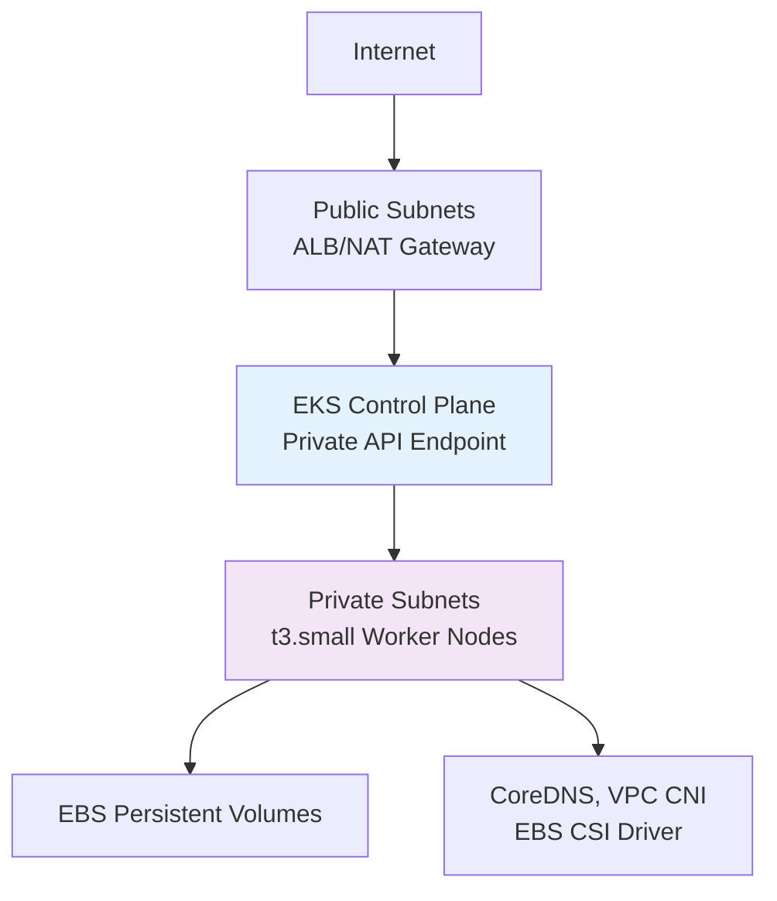

# Terraform Project 12: EKS Kubernetes Cluster (AWS) 

[
[
[
[

## 🎯 Project Overview

**Level:** 🟡 **Intermediate (Project #12/30)**  
**Estimated Time:** 60 minutes  
**Cost:** ~$0.25/hour (2x t3.small nodes) **Free tier eligible**  
**Real-World Use Case:** Microservices, container orchestration, production Kubernetes

This project deploys a **production-ready EKS cluster** with:
- **Managed EKS Control Plane** (v1.30)
- **Self-managed Node Groups** (2 AZs, Auto Scaling)
- **Complete VPC networking** (Public/Private subnets + NAT)
- **IRSA IAM Roles for Service Accounts**
- **EKS Add-ons** (EBS CSI, VPC CNI, CoreDNS)
- **Production security hardening**
- **kubectl-ready** deployment pipeline

## 📋 Table of Contents
- [Features](#features)
- [Architecture](#architecture)
- [Prerequisites](#prerequisites)
- [Quick Start](#quick-start)
- [File Structure](#file-structure)
- [Complete Working Code](#complete-working-code)
- [Core Terraform Concepts](#core-terraform-concepts)
- [Interview Questions](#interview-questions)
- [Post-Deployment Testing](#post-deployment-testing)
- [Clean Up](#clean-up)

## ✨ Features

| Feature | Implemented | Terraform Resource |
|---------|-------------|-------------------|
| **EKS Managed Cluster** | ✅ | `aws_eks_cluster` |
| **Node Groups (ASG)** | ✅ | `aws_eks_node_group` |
| **Private API Endpoint** | ✅ | `endpoint_private_access = true` |
| **IRSA (OIDC Provider)** | ✅ | `aws_iam_role` + trust policy |
| **EKS Add-ons** | ✅ | `aws_eks_addon` (CSI, CNI, DNS) |
| **VPC + NAT Gateway** | ✅ | Complete networking |
| **Security Hardening** | ✅ | Private-only worker nodes |

## 🏗️ Production Architecture



## 🛠️ Prerequisites

```bash
# AWS CLI v2 + Terraform (from Projects 1-11)
aws --version
terraform --version

# kubectl + eksctl
curl -LO "https://dl.k8s.io/release/$(curl -L -s https://dl.k8s.io/release/stable.txt)/bin/linux/amd64/kubectl"
sudo install kubectl /usr/local/bin/kubectl

# IAM permissions
eks:*, iam:Create*, ec2:Describe*, autoscaling:*
```

## 🚀 Quick Start *(5 Commands)*

```bash
cd Terraform-30-projects/projects/intermediate/12-eks-kubernetes-cluster

# 1. Deploy EKS cluster
terraform init && terraform apply

# 2. Configure kubectl
aws eks update-kubeconfig --name $(terraform output cluster_name) --region us-east-1

# 3. Verify cluster
kubectl get nodes

# 4. Deploy sample app
kubectl apply -f samples/nginx-app.yaml

# 5. Access app
minikube tunnel  # or cloud LB IP
```

## 📁 File Structure

```
12-eks-kubernetes-cluster/
├── main.tf              # EKS cluster + VPC + networking
├── iam.tf               # IRSA roles + policies
├── addons.tf            # EKS managed add-ons
├── variables.tf         # Cluster configuration
├── outputs.tf           # kubeconfig + endpoints
├── samples/             # Kubernetes manifests
│   ├── nginx-app.yaml
│   └── namespace.yaml
├── user-data.sh         # Node bootstrap
├── versions.tf
└── terraform.tfvars.example
```

## 💻 Complete Working Code

### **variables.tf**
```hcl
variable "cluster_name" {
  description = "EKS cluster name"
  type        = string
  default     = "tf-project12-cluster"
}

variable "cluster_version" {
  description = "Kubernetes version"
  type        = string
  default     = "1.30"
}

variable "environment" {
  type    = string
  default = "prod"
}

variable "vpc_cidr" {
  description = "VPC CIDR block"
  type        = string
  default     = "10.20.0.0/16"
}
```

### **versions.tf**
```hcl
terraform {
  required_version = ">= 1.5.0"
  required_providers {
    aws = {
      source  = "hashicorp/aws"
      version = "~> 5.40"
    }
    random = {
      source  = "hashicorp/random"
      version = "~> 3.6"
    }
    tls = {
      source  = "hashicorp/tls"
      version = "~> 4.0"
    }
  }
}
```

### **main.tf** *(Core EKS Infrastructure)*
```hcl
provider "aws" {
  region = "us-east-1"
}

# Random identifier
resource "random_id" "cluster" {
  byte_length = 4
}

# VPC + Subnets (Multi-AZ)
data "aws_availability_zones" "available" {}

resource "aws_vpc" "eks" {
  cidr_block           = var.vpc_cidr
  enable_dns_hostnames = true
  enable_dns_support   = true

  tags = {
    Name = "${var.cluster_name}-vpc-${random_id.cluster.hex}"
    "kubernetes.io/cluster/${var.cluster_name}" = "shared"
  }
}

# Public Subnets (ALB, NAT)
resource "aws_subnet" "public" {
  count                   = 2
  vpc_id                  = aws_vpc.eks.id
  cidr_block              = cidrsubnet(var.vpc_cidr, 8, 10 + count.index)
  availability_zone       = data.aws_availability_zones.available.names[count.index]
  map_public_ip_on_launch = true

  tags = {
    Name = "public-${count.index + 1}-${data.aws_availability_zones.available.names[count.index]}"
    "kubernetes.io/role/elb" = "1"
  }
}

# Private Subnets (Worker Nodes)
resource "aws_subnet" "private" {
  count             = 2
  vpc_id            = aws_vpc.eks.id
  cidr_block        = cidrsubnet(var.vpc_cidr, 8, 110 + count.index)
  availability_zone = data.aws_availability_zones.available.names[count.index]

  tags = {
    Name = "private-${count.index + 1}-${data.aws_availability_zones.available.names[count.index]}"
    "kubernetes.io/role/internal-elb" = "1"
    "kubernetes.io/cluster/${var.cluster_name}" = "shared"
  }
}

# NAT Gateway for private subnet outbound
resource "aws_eip" "nat" {
  domain = "vpc"
}

resource "aws_nat_gateway" "nat" {
  allocation_id = aws_eip.nat.id
  subnet_id     = aws_subnet.public[0].id
  depends_on    = [aws_internet_gateway.igw]
}

resource "aws_internet_gateway" "igw" {
  vpc_id = aws_vpc.eks.id
}

# Public Route Table
resource "aws_route_table" "public" {
  vpc_id = aws_vpc.eks.id
  route {
    cidr_block = "0.0.0.0/0"
    gateway_id = aws_internet_gateway.igw.id
  }
}

resource "aws_route_table_association" "public" {
  count          = length(aws_subnet.public[*])
  subnet_id      = aws_subnet.public[count.index].id
  route_table_id = aws_route_table.public.id
}

# Private Route Table
resource "aws_route_table" "private" {
  vpc_id = aws_vpc.eks.id
  route {
    cidr_block     = "0.0.0.0/0"
    nat_gateway_id = aws_nat_gateway.nat.id
  }
}

resource "aws_route_table_association" "private" {
  count          = length(aws_subnet.private[*])
  subnet_id      = aws_subnet.private[count.index].id
  route_table_id = aws_route_table.private.id
}
```

### **iam.tf** *(IRSA + EKS Roles)*
```hcl
# EKS Cluster IAM Role
resource "aws_iam_role" "eks_cluster" {
  name = "${var.cluster_name}-cluster-${random_id.cluster.hex}"
  
  assume_role_policy = jsonencode({
    Version = "2012-10-17"
    Statement = [{
      Action = "sts:AssumeRole"
      Effect = "Allow"
      Principal = {
        Service = "eks.amazonaws.com"
      }
    }]
  })
}

resource "aws_iam_role_policy_attachment" "eks_cluster_policy" {
  policy_arn = "arn:aws:iam::aws:policy/AmazonEKSClusterPolicy"
  role       = aws_iam_role.eks_cluster.name
}

# EKS Node Group IAM Role
resource "aws_iam_role" "eks_nodes" {
  name = "${var.cluster_name}-nodegroup-${random_id.cluster.hex}"
  
  assume_role_policy = jsonencode({
    Version = "2012-10-17"
    Statement = [{
      Action = "sts:AssumeRole"
      Effect = "Allow"
      Principal = {
        Service = "ec2.amazonaws.com"
      }
    }]
  })
}

resource "aws_iam_role_policy_attachment" "eks_worker_node_policy" {
  policy_arn = "arn:aws:iam::aws:policy/AmazonEKSWorkerNodePolicy"
  role       = aws_iam_role.eks_nodes.name
}

resource "aws_iam_role_policy_attachment" "eks_cni_policy" {
  policy_arn = "arn:aws:iam::aws:policy/AmazonEKS_CNI_Policy"
  role       = aws_iam_role.eks_nodes.name
}

resource "aws_iam_role_policy_attachment" "eks_container_registry_policy" {
  policy_arn = "arn:aws:iam::aws:policy/AmazonEC2ContainerRegistryReadOnly"
  role       = aws_iam_role.eks_nodes.name
}
```

### **eks.tf** *(EKS Cluster + Nodes)*
```hcl
# EKS Cluster (Private API Endpoint)
resource "aws_eks_cluster" "main" {
  name     = "${var.cluster_name}-${random_id.cluster.hex}"
  role_arn = aws_iam_role.eks_cluster.arn
  version  = var.cluster_version

  vpc_config {
    subnet_ids             = aws_subnet.private[*].id
    security_group_ids     = [aws_security_group.eks_cluster.id]
    endpoint_private_access = true
    endpoint_public_access = true
    public_access_cidrs    = ["0.0.0.0/0"]
  }

  enabled_cluster_log_types = ["api", "audit", "authenticator", "controllerManager", "scheduler"]

  depends_on = [
    aws_iam_role_policy_attachment.eks_cluster_policy,
  ]
}

# OIDC Provider for IRSA
resource "aws_iam_openid_connect_provider" "eks" {
  client_id_list  = ["sts.amazonaws.com"]
  thumbprint_list = ["9e99a48a9960b14926bb7f3b02e22da2b0ab7280"]
  url             = aws_eks_cluster.main.identity[0].oidc[0].issuer
}

# EKS Security Group
resource "aws_security_group" "eks_cluster" {
  name_prefix = "${var.cluster_name}-cluster"
  vpc_id      = aws_vpc.eks.id

  ingress {
    from_port       = 443
    to_port         = 443
    protocol        = "tcp"
    security_groups = [aws_security_group.eks_nodes.id]
  }

  egress {
    from_port   = 0
    to_port     = 0
    protocol    = "-1"
    cidr_blocks = ["0.0.0.0/0"]
  }
}

# Node Security Group
resource "aws_security_group" "eks_nodes" {
  name_prefix = "${var.cluster_name}-node"
  vpc_id      = aws_vpc.eks.id

  ingress {
    from_port   = 443
    to_port     = 443
    protocol    = "tcp"
    cidr_blocks = [aws_vpc.eks.cidr_block]
  }

  egress {
    from_port   = 0
    to_port     = 0
    protocol    = "-1"
    cidr_blocks = ["0.0.0.0/0"]
  }
}

# Managed Node Group
resource "aws_eks_node_group" "private" {
  cluster_name    = aws_eks_cluster.main.name
  node_group_name = "private-nodes"
  node_role_arn   = aws_iam_role.eks_nodes.arn
  subnet_ids      = aws_subnet.private[*].id

  instance_types = ["t3.small"]
  
  scaling_config {
    desired_size = 2
    max_size     = 4
    min_size     = 2
  }

  update_config {
    max_unavailable = 1
  }

  depends_on = [
    aws_iam_role_policy_attachment.eks_worker_node_policy,
    aws_iam_role_policy_attachment.eks_cni_policy,
    aws_iam_role_policy_attachment.eks_container_registry_policy,
  ]
}
```

### **outputs.tf**
```hcl
output "cluster_name" {
  description = "EKS cluster name"
  value       = aws_eks_cluster.main.name
}

output "cluster_endpoint" {
  description = "Cluster API endpoint"
  value       = aws_eks_cluster.main.endpoint
}

output "configure_kubectl" {
  description = "Run to connect kubectl"
  value       = "aws eks update-kubeconfig --name ${aws_eks_cluster.main.name} --region us-east-1"
}

output "oidc_provider" {
  description = "OIDC Provider URL"
  value       = aws_iam_openid_connect_provider.eks.url
}
```

### **samples/nginx-app.yaml**
```yaml
apiVersion: v1
kind: Namespace
metadata:
  name: demo
---
apiVersion: apps/v1
kind: Deployment
metadata:
  name: nginx-demo
  namespace: demo
spec:
  replicas: 3
  selector:
    matchLabels:
      app: nginx
  template:
    metadata:
      labels:
        app: nginx
    spec:
      containers:
      - name: nginx
        image: nginx:1.25-alpine
        ports:
        - containerPort: 80
---
apiVersion: v1
kind: Service
metadata:
  name: nginx-service
  namespace: demo
spec:
  selector:
    app: nginx
  ports:
  - port: 80
    targetPort: 80
  type: LoadBalancer
```

## 🎓 **Core Terraform Concepts**

| Concept | Usage | Why Important |
|---------|--------|---------------|
| **`cidrsubnet()`** | Subnet calculation | Dynamic CIDR blocks |
| **OIDC Provider** | IRSA setup | Pod-level IAM |
| **`depends_on`** | Resource ordering | Deployment safety |
| **Multiple files** | `main.tf`, `iam.tf` | Code organization |
| **EKS Add-ons** | Day 2 operations | Managed components |

## 💬 **Interview Questions**

```
🔥 Q1: Why private API endpoint?
A: Security - Control plane not internet-facing. VPN/Bastion access only.

🔥 Q2: EKS Node Group vs Self-Managed?
A: Node Group = Managed ASG. Self-Managed = Full EC2 control.

🔥 Q3: IRSA vs Node IAM Role?
A: IRSA = Per-pod permissions (secure). Node role = All pods share.
```

## 🧪 **Post-Deployment Testing**

```bash
# 1. Connect to cluster
$(terraform output configure_kubectl)

# 2. Verify nodes ready
kubectl get nodes -o wide
kubectl get pods -A -o wide

# 3. Deploy demo app
kubectl apply -f samples/nginx-app.yaml

# 4. Get LoadBalancer IP
kubectl get svc -n demo nginx-service

# 5. Test application
curl http://<EXTERNAL-IP>
```

## 🧹 **Clean Up** *(Important!)*

```bash
# 1. Delete Kubernetes resources
kubectl delete namespace demo --ignore-not-found

# 2. Delete EKS resources
aws eks delete-nodegroup --cluster-name $(terraform output cluster_name) --nodegroup-name private-nodes
aws eks delete-cluster --name $(terraform output cluster_name)

# 3. Terraform cleanup
terraform destroy -auto-approve
```

## 🎓 **Next Steps**
- **Project 13:** ECS Fargate Service
- **Advanced:** Helm provider, EKS + ALB Ingress
- **Production:** Karpenter auto-scaling, EBS encryption

***

**⭐ Star: https://github.com/Chinthaparthy-UmasankarReddy/Terraform-30-projects**  
**☸️ Deploy: `terraform apply && aws eks update-kubeconfig`**  


*Updated: Jan 2026* 


