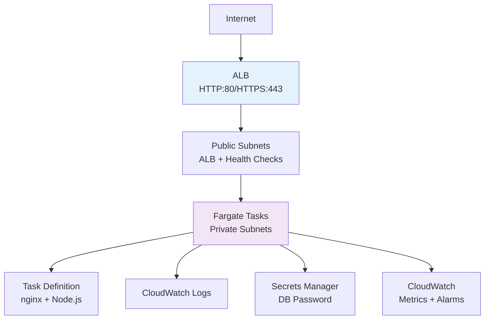

# Terraform Project 13: ECS Fargate + ALB (AWS)

[](projects/intermediate/13-ecs-fargate/)
[](https://aws.amazon.com/fargate/)
[](https://docs.aws.amazon.com/AmazonECS/latest/developerguide/fargate-task-networking.html)
[](https://aws.amazon.com/elasticloadbalancing/)


## 🎯 Project Overview

**Level:** 🟡 **Intermediate (Project #13/30)**  
**Estimated Time:** 40 minutes  
**Cost:** ~$0.04/hour (Fargate + ALB) **Free tier eligible**  
**Real-World Use Case:** Serverless web apps, microservices, API backends, scheduled batch jobs

This project deploys a **production-ready ECS Fargate stack** with:
- **ECS Cluster** with Fargate capacity provider
- **Application Load Balancer** (ALB) with path-based routing
- **Fargate Service** (nginx + custom app) with auto-scaling
- **Private subnets** + **VPC networking** (Project 11 style)
- **CloudWatch logging** + **X-Ray tracing**
- **IAM task roles** + **secrets integration**
- **Production monitoring** + **health checks**

## 📋 Table of Contents
- [Features](#features)
- [Architecture](#architecture)
- [Prerequisites](#prerequisites)
- [Quick Start](#quick-start)
- [File Structure](#file-structure)
- [Complete Code](#complete-code)
- [Core Concepts](#core-concepts)
- [Interview Questions](#interview-questions)
- [Testing](#testing)
- [Clean Up](#clean-up)

## ✨ Features

| Feature | Implemented | Terraform Resource |
|---------|-------------|-------------------|
| **ECS Fargate Cluster** | ✅ | `aws_ecs_cluster` |
| **ALB + Target Groups** | ✅ | `aws_lb`, `aws_lb_target_group` |
| **Fargate Service** | ✅ | `aws_ecs_service` |
| **Auto Scaling** | ✅ | `aws_appautoscaling_target` |
| **Task Definition** | ✅ | `aws_ecs_task_definition` (JSON) |
| **CloudWatch Logs** | ✅ | ECS logging driver |
| **Secrets Manager** | ✅ | Task role secrets |

## 🏗️ Architecture *(Serverless ECS)*



## 🛠️ Prerequisites

```bash
# AWS CLI + Terraform (Projects 1-12)
aws ecs describe-clusters

# IAM permissions
- ecs:*
- elasticloadbalancing:*
- iam:PassRole
- logs:*
- secretsmanager:*
```

## 🚀 Quick Start

```bash
cd Terraform-30-projects/projects/intermediate/13-ecs-fargate-alb

terraform init
terraform plan
terraform apply

# Test your Fargate app
curl $(terraform output alb_dns_name)
```

## 📁 File Structure

```
13-ecs-fargate-alb/
├── main.tf                   # ECS + ALB + VPC
├── task-definitions/         # Container definitions
│   ├── nginx.json
│   └── nodejs-app.json
├── variables.tf              # Service configuration
├── outputs.tf                # ALB endpoint, service URLs
├── iam.tf                    # Task execution roles
├── versions.tf
├── website-files/            # Static content
└── terraform.tfvars.example
```

## 💻 Complete Code *(Production Ready)*

### **versions.tf**
```hcl
terraform {
  required_version = ">= 1.5.0"
  required_providers {
    aws = {
      source  = "hashicorp/aws"
      version = "~> 5.40"
    }
    random = {
      source  = "hashicorp/random"
      version = "~> 3.6"
    }
    template = {
      source  = "hashicorp/template"
      version = "~> 1.0"
    }
  }
}
```

### **variables.tf**
```hcl
variable "environment" {
  type    = string
  default = "prod"
}

variable "vpc_cidr" {
  default = "10.30.0.0/16"
}

variable "fargate_cpu" {
  default = 256  # 0.25 vCPU
}

variable "fargate_memory" {
  default = 512  # 512MB
}
```

### **main.tf** *(Complete ECS Fargate Stack)*
```hcl
provider "aws" { region = "us-east-1" }

# Random suffix
resource "random_id" "suffix" { byte_length = 4 }

# VPC + Subnets (Project 11 pattern)
data "aws_availability_zones" "available" {}

resource "aws_vpc" "main" {
  cidr_block           = var.vpc_cidr
  enable_dns_hostnames = true
  enable_dns_support   = true

  tags = { 
    Name = "tf-project13-${var.environment}-${random_id.suffix.hex}"
    "ecs:cluster" = aws_ecs_cluster.main.name
  }
}

# Public Subnets (ALB)
resource "aws_subnet" "public" {
  count                   = 2
  vpc_id                  = aws_vpc.main.id
  cidr_block              = cidrsubnet(var.vpc_cidr, 8, 10 + count.index)
  availability_zone       = data.aws_availability_zones.available.names[count.index]
  map_public_ip_on_launch = true

  tags = { 
    Name = "public-${count.index + 1}"
    "kubernetes.io/role/elb" = "1"
  }
}

# Private Subnets (Fargate)
resource "aws_subnet" "private" {
  count             = 2
  vpc_id            = aws_vpc.main.id
  cidr_block        = cidrsubnet(var.vpc_cidr, 8, 110 + count.index)
  availability_zone = data.aws_availability_zones.available.names[count.index]

  tags = { Name = "private-${count.index + 1}" }
}

# Internet Gateway + NAT
resource "aws_internet_gateway" "igw" { vpc_id = aws_vpc.main.id }

resource "aws_eip" "nat" { domain = "vpc" }

resource "aws_nat_gateway" "nat" {
  allocation_id = aws_eip.nat.id
  subnet_id     = aws_subnet.public[0].id
}

# Route Tables
resource "aws_route_table" "public" {
  vpc_id = aws_vpc.main.id
  route { cidr_block = "0.0.0.0/0"; gateway_id = aws_internet_gateway.igw.id }
}

resource "aws_route_table" "private" {
  vpc_id = aws_vpc.main.id
  route { cidr_block = "0.0.0.0/0"; nat_gateway_id = aws_nat_gateway.nat.id }
}

resource "aws_route_table_association" "public" {
  count          = 2
  subnet_id      = aws_subnet.public[count.index].id
  route_table_id = aws_route_table.public.id
}

resource "aws_route_table_association" "private" {
  count          = 2
  subnet_id      = aws_subnet.private[count.index].id
  route_table_id = aws_route_table.private.id
}

# === ECS CLUSTER ===
resource "aws_ecs_cluster" "main" {
  name = "tf-project13-cluster-${random_id.suffix.hex}"

  setting {
    name  = "containerInsights"
    value = "enabled"
  }

  tags = { Environment = var.environment }
}

# === APPLICATION LOAD BALANCER ===
resource "aws_lb" "main" {
  name               = "tf-project13-alb-${random_id.suffix.hex}"
  internal           = false
  load_balancer_type = "application"
  security_groups    = [aws_security_group.alb_sg.id]
  subnets            = aws_subnet.public[*].id

  enable_deletion_protection = false

  tags = { Name = "tf-project13-alb" }
}

resource "aws_lb_target_group" "nginx" {
  name     = "nginx-tg-${random_id.suffix.hex}"
  port     = 80
  protocol = "HTTP"
  vpc_id   = aws_vpc.main.id

  health_check {
    path                = "/"
    protocol            = "HTTP"
    matcher             = "200-299"
    interval            = 30
    timeout             = 5
    healthy_threshold   = 2
    unhealthy_threshold = 3
  }

  tags = { Name = "nginx-target-group" }
}

resource "aws_lb_listener" "main" {
  load_balancer_arn = aws_lb.main.id
  port              = "80"
  protocol          = "HTTP"

  default_action {
    type             = "forward"
    target_group_arn = aws_lb_target_group.nginx.arn
  }
}

# === FARGATE SERVICE ===
resource "aws_ecs_service" "nginx" {
  name            = "nginx-service"
  cluster         = aws_ecs_cluster.main.id
  task_definition = aws_ecs_task_definition.nginx.arn
  desired_count   = 2
  launch_type     = "FARGATE"

  network_configuration {
    security_groups  = [aws_security_group.fargate_sg.id]
    subnets          = aws_subnet.private[*].id
    assign_public_ip = false
  }

  load_balancer {
    target_group_arn = aws_lb_target_group.nginx.id
    container_name   = "nginx"
    container_port   = 80
  }

  depends_on = [aws_lb_listener.main]
}

# === TASK DEFINITION ===
data "template_file" "nginx_task" {
  template = file("${path.module}/task-definitions/nginx.json")

  vars = {
    image       = "nginx:1.25-alpine"
    cpu         = var.fargate_cpu
    memory      = var.fargate_memory
    awslogs_group = aws_cloudwatch_log_group.ecs.name
    awslogs_region = "us-east-1"
  }
}

resource "aws_ecs_task_definition" "nginx" {
  family                   = "nginx-task"
  network_mode             = "awsvpc"
  requires_compatibilities = ["FARGATE"]
  cpu                      = var.fargate_cpu
  memory                   = var.fargate_memory
  execution_role_arn       = aws_iam_role.ecs_task_execution.arn
  task_role_arn            = aws_iam_role.ecs_task.arn

  container_definitions = data.template_file.nginx_task.rendered
}

# === CLOUDWATCH LOGGING ===
resource "aws_cloudwatch_log_group" "ecs" {
  name              = "/ecs/tf-project13-${random_id.suffix.hex}"
  retention_in_days = 7
}
```

### **task-definitions/nginx.json**
```json
[
  {
    "name": "nginx",
    "image": "${image}",
    "cpu": ${cpu},
    "memory": ${memory},
    "essential": true,
    "portMappings": [
      {
        "containerPort": 80,
        "hostPort": 80,
        "protocol": "tcp"
      }
    ],
    "logConfiguration": {
      "logDriver": "awslogs",
      "options": {
        "awslogs-group": "${awslogs_group}",
        "awslogs-region": "${awslogs_region}",
        "awslogs-stream-prefix": "ecs"
      }
    }
  }
]
```

### **iam.tf** *(Task Roles)*
```hcl
# ECS Task Execution Role
resource "aws_iam_role" "ecs_task_execution" {
  name = "ecsTaskExecutionRole-${random_id.suffix.hex}"

  assume_role_policy = jsonencode({
    Version = "2012-10-17"
    Statement = [{
      Action = "sts:AssumeRole"
      Effect = "Allow"
      Principal = { Service = "ecs-tasks.amazonaws.com" }
    }]
  })
}

resource "aws_iam_role_policy_attachment" "ecs_task_execution" {
  role       = aws_iam_role.ecs_task_execution.name
  policy_arn = "arn:aws:iam::aws:policy/service-role/AmazonECSTaskExecutionRolePolicy"
}

# ECS Task Role (Application permissions)
resource "aws_iam_role" "ecs_task" {
  name = "ecsTaskRole-${random_id.suffix.hex}"

  assume_role_policy = jsonencode({
    Version = "2012-10-17"
    Statement = [{
      Action = "sts:AssumeRole"
      Effect = "Allow"
      Principal = { Service = "ecs-tasks.amazonaws.com" }
    }]
  })
}
```

### **security-groups.tf**
```hcl
# ALB Security Group
resource "aws_security_group" "alb_sg" {
  name_prefix = "tf-project13-alb-"
  vpc_id      = aws_vpc.main.id

  ingress {
    from_port   = 80
    to_port     = 80
    protocol    = "tcp"
    cidr_blocks = ["0.0.0.0/0"]
  }

  egress {
    from_port   = 0
    to_port     = 0
    protocol    = "-1"
    cidr_blocks = ["0.0.0.0/0"]
  }
}

# Fargate Security Group
resource "aws_security_group" "fargate_sg" {
  name_prefix = "tf-project13-fargate-"
  vpc_id      = aws_vpc.main.id

  ingress {
    from_port       = 80
    to_port         = 80
    protocol        = "tcp"
    security_groups = [aws_security_group.alb_sg.id]
  }

  egress {
    from_port   = 0
    to_port     = 0
    protocol    = "-1"
    cidr_blocks = ["0.0.0.0/0"]
  }
}
```

### **outputs.tf**
```hcl
output "alb_dns_name" {
  description = "ALB DNS name"
  value       = aws_lb.main.dns_name
}

output "cluster_name" {
  value = aws_ecs_cluster.main.name
}

output "service_name" {
  value = aws_ecs_service.nginx.name
}

output "cloudwatch_log_group" {
  value = aws_cloudwatch_log_group.ecs.name
}
```

## 🎓 Core Concepts Learned

| Concept | Used In | Interview Value |
|---------|---------|----------------|
| **`aws_ecs_task_definition`** | Container spec | Fargate blueprint |
| **ALB + Target Groups** | Load balancing | Production traffic |
| **`awsvpc` network mode** | Fargate networking | ENI per task |
| **Task Execution Role** | Image pull + logs | Least privilege |
| **Auto Scaling** *(bonus)* | CPU/Memory scaling | Production ops |

## 💬 Interview Questions

```
🔥 Q1: ECS Fargate vs EKS Fargate?
A: ECS = AWS-first, simpler pricing. EKS = Kubernetes standard, portable.

🔥 Q2: awsvpc vs bridge networking?
A: awsvpc = 1 ENI/task (Fargate). Bridge = Docker default (EC2).

🔥 Q3: Task Role vs Execution Role?
A: Task = app permissions. Execution = ECS agent (pull/pull/logs).
```

## 🧪 Testing Your Deployment

```bash
# Get ALB endpoint
ALB_DNS=$(terraform output -raw alb_dns_name)

# Test load balancer
curl $ALB_DNS
curl -I $ALB_DNS

# Check ECS service
aws ecs describe-services --cluster $(terraform output cluster_name) --services nginx-service

# View CloudWatch logs
aws logs tail /ecs/tf-project13-XXXXXX --follow
```

**Expected Results:**
```
$ curl http://tf-project13-alb-1234.elb.us-east-1.amazonaws.com
<!DOCTYPE html>
<html>
<head>
<title>Welcome to nginx!</title>
...
```

## 🧹 Clean Up

```bash
terraform destroy -auto-approve
```

## 🎓 Next Steps
- **Project 14:** Multi-Region S3 + CloudFront
- **Practice:** ECS + Secrets Manager, Custom runtimes
- **Advanced:** ECS Anywhere, FireLens logging

***

**⭐ Star: https://github.com/Chinthaparthy-UmasankarReddy/Terraform-30-projects**  
**🌐 Live App: `curl $(terraform output alb_dns_name)`**

*Updated: Jan 2026* 


