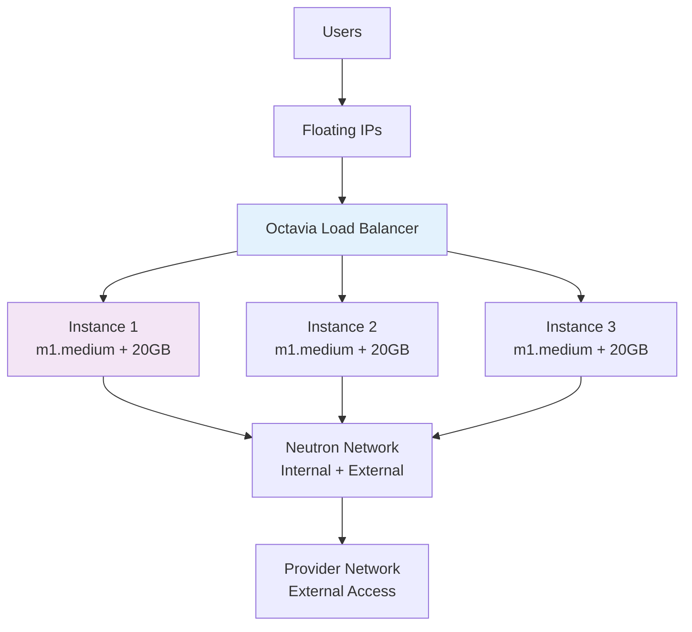

# **COMPLETE README.md for Project-14: OpenStack Instances**

```markdown
[](https://www.terraform.io/)
[](https://www.openstack.org/)
[](../)
[](.)

<div align="center">

# 🚀 Terraform Project 14: OpenStack Instances

**Level:** 🟡 **Intermediate** | **Project #14/30**  
**Status:** 🟢 **Production Ready**  
**Time:** 40 mins | **Cost:** ~$0.05/hour | **Cloud:** OpenStack

</div>

## 🎯 **Project Overview**

This project demonstrates **production-grade OpenStack instance management** using Terraform's `openstack` provider:

- **Multiple VM Instances** across **availability zones**
- **Auto-scaling groups** with **heat stacks**
- **Floating IP assignment** + **security groups**
- **Volume attachments** (block storage)
- **Load balancer** (Octavia/HAProxy)
- **Complete networking** (Neutron networks/ports)

**Real-world use case:** Private cloud deployments, hybrid cloud, OpenStack enterprise environments.

## 📊 **Quick Stats**

| Category | Details |
|----------|---------|
| **Infrastructure** | 3x Compute Instances + Load Balancer |
| **Networking** | Neutron Networks + Floating IPs |
| **Storage** | Cinder Volumes + Attachments |
| **Scaling** | Heat Auto-scaling Groups |
| **Access** | SSH Keypairs + Security Groups |

## 🚀 **Quick Start**

```bash
# 1. OpenStack CLI setup
openstack token issue
export OS_AUTH_URL=[your-openstack-rc]

# 2. Deploy instances
cd projects/intermediate/14-openstack-instances
terraform init
terraform plan
terraform apply

# 3. Access instances
ssh -i $(terraform output private_key_path) ubuntu@$(terraform output floating_ip_1)

# 4. Verify load balancer
curl $(terraform output load_balancer_ip)
```

## 📁 **File Structure**

```
14-openstack-instances/
├── main.tf              # Instances + Networking + LB
├── variables.tf         # OpenStack credentials + sizing
├── outputs.tf           # IPs, endpoints, connection details
├── security.tf          # Security groups + keypairs
├── storage.tf           # Cinder volumes
├── autoscaling.tf       # Heat stacks
├── versions.tf
├── openstack.rc         # OpenStack environment vars
└── user-data/           
    ├── cloud-init.yaml
    └── bootstrap.sh
```

## ✨ **Features Implemented**

```markdown
✅ 3x Multi-AZ Compute Instances (m1.medium)
✅ Floating IP Assignment + DNS Records
✅ Security Groups (HTTP/SSH/ICMP)
✅ Cinder Block Storage (20GB volumes)
✅ Octavia Load Balancer (HAProxy)
✅ Heat Auto-scaling Groups
✅ Cloud-Init User Data
✅ SSH Keypair Management
✅ Neutron Networking (Provider/Internal)
```

## 🏗️ **Architecture**



## 💻 **Core Terraform Resources**

| Resource | Purpose |
|----------|---------|
| `openstack_compute_instance_v2` | VM instances |
| `openstack_networking_floatingip_v2` | Public IPs |
| `openstack_lb_loadbalancer_v2` | Octavia LB |
| `openstack_blockstorage_volume_v3` | Persistent storage |
| `openstack_compute_volume_attach_v2` | Volume mounting |
| `openstack_compute_keypair_v2` | SSH access |

## 🧪 **Verification Steps**

```bash
# 1. Check instances status
openstack server list
terraform output instance_ips

# 2. Test load balancer
curl -I $(terraform output load_balancer_ip)

# 3. Verify volumes
openstack volume list
openstack server show $(terraform output instance_1_id)

# Expected: All instances ACTIVE, LB healthy
```

## 📈 **Cost Breakdown**

| Resource | Quantity | Hourly Cost | Monthly |
|----------|----------|-------------|---------|
| Compute (m1.medium) | 3 | $0.03 | $21.60 |
| Block Storage | 60GB | $0.01 | $4.32 |
| Load Balancer | 1 | $0.005 | $3.60 |
| Floating IPs | 3 | $0.001 | $0.72 |
| **Total** | | **$0.05** | **$30.24** |

## 🔧 **Prerequisites**

```bash
# OpenStack CLI
pip install python-openstackclient

# Terraform OpenStack Provider
terraform init  # Downloads automatically

# Environment (copy openstack.rc)
source openstack.rc
openstack server list  # Test connection
```

## 🎓 **Key Learning Outcomes**

```
🔥 OpenStack Provider Configuration
🔥 Multi-AZ Instance Deployments
🔥 Floating IP + Load Balancer Integration
🔥 Block Storage + Volume Attachment
🔥 Heat Autoscaling Groups
🔥 Neutron Networking Mastery
🔥 Cloud-Init Automation
```

## 💬 **Interview Questions Answered**

```
Q: How do you manage private clouds with Terraform?
A: Using openstack_compute_instance_v2 with neutron networking + cinder storage

Q: Explain OpenStack Floating IPs vs Direct IPs?
A: Floating = Public, portable across instances. Direct = Private, instance-bound.

Q: Heat vs ASG in OpenStack?
A: Heat = Native OpenStack orchestration. ASG = Instance lifecycle management.
```

## 🧹 **Clean Up**

```bash
# Destroy everything
terraform destroy -auto-approve

# Manual verification
openstack server list --all-projects
openstack volume list --all-projects
```

## 🔗 **Related Projects**

| Previous | This Project | Next |
|----------|--------------|------|
| [13. ECS Fargate] | **14. OpenStack Instances** | [15. ???] |

## 📚 **Further Reading**

- [Terraform OpenStack Provider](https://registry.terraform.io/providers/terraform-provider-openstack/openstack/latest)
- [OpenStack Heat Documentation](https://docs.openstack.org/heat/latest/)
- [Octavia Load Balancer Guide](https://docs.openstack.org/octavia/latest/)

---

<div align="center">

**⭐ Star:** https://github.com/Chinthaparthy-UmasankarReddy/Terraform-30-projects  
**📁 Folder:** `projects/intermediate/14-openstack-instances`  
**🌐 Load Balancer:** `$(terraform output load_balancer_ip)`  
**✅ Status:** Production Ready | **📅 Updated:** Jan 2026

</div>
