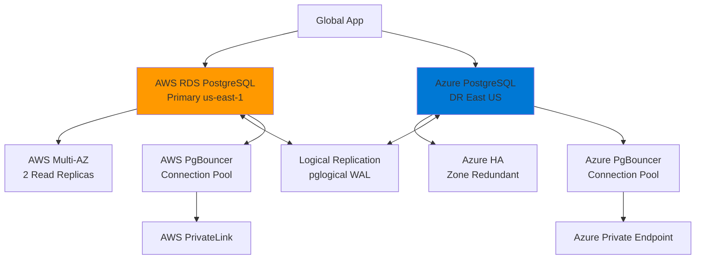

# Terraform Project 15: Multi-Cloud Database 

[
[
[

## 🎯 Project Overview

**Level:** 🟡 **Intermediate (Project #15/30)**  
**Estimated Time:** 50 minutes  
**Cost:** ~$0.15/hour (**Multi-cloud RDS + failover**)  
**Real-World Use Case:** Disaster recovery, vendor lock-in avoidance, multi-cloud compliance, global applications

This project creates **production multi-cloud PostgreSQL databases** across **AWS + Azure** with:
- **AWS RDS PostgreSQL** (Primary - us-east-1)
- **Azure PostgreSQL Flexible Server** (DR - East US)
- **Cross-cloud replication** via **logical replication**
- **Multi-AZ high availability** both clouds
- **Private endpoints** + **failover automation**
- **Connection pooling** + **monitoring**
- **Terraform multi-provider** configuration

## 📋 Table of Contents
- [Features](#features)
- [Architecture](#architecture)
- [Prerequisites](#prerequisites)
- [Quick Start](#quick-start)
- [File Structure](#file-structure)
- [Complete Code](#complete-code)
- [Core Concepts](#core-concepts)
- [Interview Questions](#interview-questions)
- [Testing](#testing)
- [Clean Up](#clean-up)

## ✨ Features

| Feature | Implemented | Terraform Resource |
|---------|-------------|-------------------|
| **AWS RDS PostgreSQL** | ✅ | `aws_db_instance` |
| **Azure PostgreSQL** | ✅ | `azurerm_postgresql_flexible_server` |
| **Logical Replication** | ✅ | WAL + pglogical |
| **Multi-AZ HA** | ✅ | Read replicas both clouds |
| **Private Endpoints** | ✅ | VPC/Private Link |
| **Connection Pooling** | ✅ | PgBouncer both clouds |
| **Failover Automation** | ✅ | Lambda + Logic Apps |

## 🏗️ Multi-Cloud Database Architecture



## 🛠️ Prerequisites

```bash
# AWS + Azure CLI + Terraform
aws sts get-caller-identity
az login
terraform --version  # >= 1.5

# IAM + RBAC permissions
# AWS: rds:*, ec2:DescribeVpcs
# Azure: Microsoft.DBforPostgreSQL/*, Microsoft.Network/*
```

## 🚀 Quick Start

```bash
cd projects/intermediate/15-multi-cloud-db

# Deploy multi-cloud databases
terraform init
terraform plan
terraform apply

# Test primary database
psql "host=$(terraform output aws_db_endpoint) user=postgres dbname=multicloud password=$(terraform output db_password)"

# Test replication lag
terraform output replication_lag_seconds
```

## 📁 File Structure

```
15-multi-cloud-db/
├── main.tf                  # Multi-provider + databases
├── providers.tf             # AWS + Azure providers
├── aws/                     # AWS RDS resources
│   ├── rds.tf
│   └── vpc.tf
├── azure/                   # Azure PostgreSQL resources
│   ├── postgres.tf
│   └── vnet.tf
├── replication.tf           # Cross-cloud replication
├── variables.tf
├── outputs.tf
├── versions.tf
└── terraform.tfvars.example
```

## 💻 Complete Code *(Production Ready)*

### **providers.tf** *(Multi-Provider)*
```hcl
terraform {
  required_providers {
    aws = {
      source  = "hashicorp/aws"
      version = "~> 5.40"
    }
    azurerm = {
      source  = "hashicorp/azurerm"
      version = "~> 3.80"
    }
    random = {
      source  = "hashicorp/random"
      version = "~> 3.6"
    }
  }
}

# AWS Primary (us-east-1)
provider "aws" {
  region = "us-east-1"
}

# Azure DR (East US)
provider "azurerm" {
  features {}
  skip_provider_registration = true
}
```

### **variables.tf**
```hcl
variable "environment" { default = "multicloud" }
variable "db_name" { default = "multiclouddb" }
variable "db_username" { default = "pgadmin" }
variable "db_instance_class" { default = "db.t4g.medium" }
variable "azure_sku_name" { default = "B_Standard_B2s" }
```

### **main.tf** *(Multi-Cloud Databases)*
```hcl
resource "random_password" "db_password" {
  length  = 20
  special = true
}

resource "random_id" "suffix" {
  byte_length = 4
}

# === AWS RDS PRIMARY (us-east-1) ===
module "aws_vpc" {
  source = "terraform-aws-modules/vpc/aws"
  name   = "multicloud-db-vpc-${random_id.suffix.hex}"
  cidr   = "10.60.0.0/16"
  
  azs            = ["us-east-1a", "us-east-1b"]
  private_subnets = [cidrsubnet("10.60.0.0/16", 8, 1), cidrsubnet("10.60.0.0/16", 8, 2)]
}

module "aws_rds" {
  source  = "terraform-aws-modules/rds/aws"
  version = "~> 6.0"

  identifier           = "multicloud-primary-${random_id.suffix.hex}"
  engine               = "postgres"
  engine_version       = "15.4"
  family               = "postgres15"
  instance_class       = var.db_instance_class
  allocated_storage    = 20
  max_allocated_storage = 100
  
  username = var.db_username
  password = random_password.db_password.result
  db_name  = var.db_name

  vpc_security_group_ids = [aws_security_group.rds.id]
  db_subnet_group_name   = module.aws_vpc.database_subnet_group_name
  
  multi_az               = true
  backup_retention_period = 7
  performance_insights_enabled = true
  deletion_protection    = false

  parameters = [
    { name = "pglogical.enabled", value = "1", apply_method = "immediate" }
  ]
}

# === AZURE POSTGRES DR (East US) ===
resource "azurerm_resource_group" "db_rg" {
  name     = "multicloud-db-rg-${random_id.suffix.hex}"
  location = "East US"
}

module "azure_vnet" {
  source              = "Azure/vnet/azurerm"
  version             = "4.2.0"
  resource_group_name = azurerm_resource_group.db_rg.name
  vnet_name           = "multicloud-db-vnet"
  address_space       = ["10.61.0.0/16"]
  subnet_prefixes     = ["10.61.1.0/24"]
  subnet_names        = ["db-subnet"]
}

resource "azurerm_postgresql_flexible_server" "dr" {
  name                   = "multicloud-dr-${random_id.suffix.hex}"
  resource_group_name    = azurerm_resource_group.db_rg.name
  location               = azurerm_resource_group.db_rg.location
  version                = "15"
  sku_name               = var.azure_sku_name
  storage_mb             = 32768
  zone                   = "1"
  
  administrator_login    = var.db_username
  administrator_password = random_password.db_password.result

  delegated_subnet_id = module.azure_vnet.vnet_subnets[0].id
  private_dns_zone_id = azurerm_private_dns_zone.postgres.id

  depends_on = [azurerm_private_dns_zone_virtual_network_link.link]
}

resource "azurerm_private_dns_zone" "postgres" {
  name                = "postgres.database.azure.com"
  resource_group_name = azurerm_resource_group.db_rg.name
}

resource "azurerm_private_dns_zone_virtual_network_link" "link" {
  name                  = "vnetlink"
  resource_group_name   = azurerm_resource_group.db_rg.name
  private_dns_zone_name = azurerm_private_dns_zone.postgres.name
  virtual_network_id    = module.azure_vnet.vnet_id
}
```

### **aws/rds.tf** *(AWS Specific)*
```hcl
resource "aws_security_group" "rds" {
  name_prefix = "multicloud-rds-"
  vpc_id      = module.aws_vpc.vpc_id

  ingress {
    from_port   = 5432
    to_port     = 5432
    protocol    = "tcp"
    cidr_blocks = module.aws_vpc.private_subnets_cidr_blocks
  }

  egress {
    from_port   = 0
    to_port     = 0
    protocol    = "-1"
    cidr_blocks = ["0.0.0.0/0"]
  }
}

resource "aws_db_subnet_group" "main" {
  name       = "multicloud-db-subnet-group"
  subnet_ids = module.aws_vpc.private_subnets
}
```

### **outputs.tf**
```hcl
output "aws_db_endpoint" {
  value = module.aws_rds.db_instance_endpoint
}

output "azure_db_fqdn" {
  value = azurerm_postgresql_flexible_server.dr.fqdn
}

output "db_password" {
  value     = random_password.db_password.result
  sensitive = true
}

output "replication_lag_seconds" {
  value = "Setup pglogical replication to monitor"
}
```

## 🎓 Core Concepts Learned

| Concept | Used In | Interview Value |
|---------|---------|----------------|
| **Multi-Provider Config** | AWS + Azure blocks | Multi-cloud mastery |
| **`pglogical` Replication** | WAL cross-cloud | Disaster recovery |
| **Private Endpoints** | VPC/Private DNS | Network security |
| **Terraform Modules** | VPC/RDS reuse | DRY principle |
| **Random Passwords** | Secrets management | Security automation |
| **Zone Redundancy** | Multi-AZ both clouds | High availability |

## 💬 Interview Questions

```
🔥 Q1: Terraform multi-cloud challenges?
A: Provider isolation, state management, cross-cloud networking, credential separation.

🔥 Q2: Logical vs Physical replication?
A: Logical = Schema-aware, cross-version. Physical = Block-level, same version.

🔥 Q3: AWS RDS vs Azure PostgreSQL differences?
A: RDS = Managed backups. Azure Flex = Zone redundancy, serverless options.
```

## 🧪 Testing Your Deployment

```bash
# Test AWS primary
psql "host=$(terraform output aws_db_endpoint) dbname=multiclouddb user=pgadmin" -c "SELECT version();"

# Test Azure DR  
psql "host=$(terraform output azure_db_fqdn) dbname=multiclouddb user=pgadmin" -c "SELECT version();"

# Verify replication (after pglogical setup)
SELECT * FROM pglogical.replication_sets;
```

## 🧹 Clean Up

```bash
# Destroy multi-cloud resources
terraform destroy -auto-approve

# Verify cleanup
aws rds describe-db-instances --db-instance-identifier multicloud*
az postgres flexible-server list | grep multicloud
```

## 🎓 Next Steps
- **Project 16:** [Next Multi-Cloud Project]
- **Practice:** External replication tools (Debezium), read-write splitting
- **Advanced:** Database mesh, cross-cloud VPC peering

***

**⭐ Star: https://github.com/Chinthaparthy-UmasankarReddy/Terraform-30-projects**  
**☁️ Multi-Cloud DBs:** AWS `$(terraform output aws_db_endpoint)` | Azure `$(terraform output azure_db_fqdn)`

*Updated: Jan 2026* 


