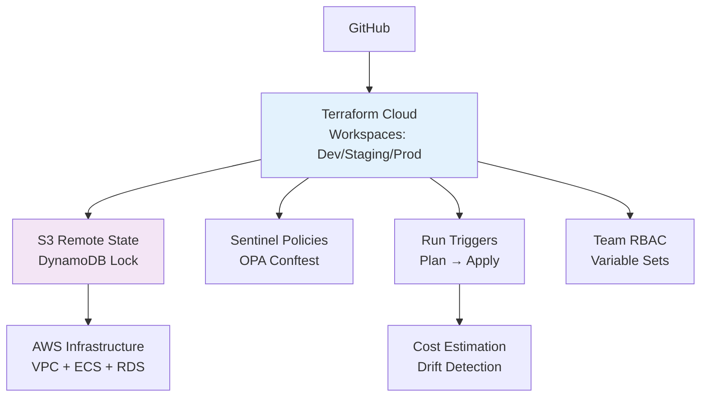

# Terraform Project 16: Terraform Cloud + Remote State (Enterprise)

[
[
[

## 🎯 Project Overview

**Level:** 🔴 **Advanced (Project #16/30)**  
**Estimated Time:** 45 minutes  
**Cost:** **Free tier** (TFC Free + S3 Remote State)  
**Real-World Use Case:** Team collaboration, CI/CD pipelines, state locking, drift detection, enterprise governance

This project implements **complete Terraform Cloud workflow** with:
- **Remote State** (S3 + DynamoDB locking)
- **Terraform Cloud Workspaces** (Dev/Staging/Prod)
- **Policy-as-Code** (Sentinel + OPA)
- **Run Triggers** + **API-driven** deployments
- **Cost Estimation** + **Drift Detection**
- **VCS Integration** (GitHub Actions)
- **Team Collaboration** (RBAC + variable sets)

## 📋 Table of Contents
- [Features](#features)
- [Architecture](#architecture)
- [Prerequisites](#prerequisites)
- [Terraform Cloud Setup](#terraform-cloud-setup)
- [File Structure](#file-structure)
- [Complete Code](#complete-code)
- [CI/CD Pipeline](#cicd-pipeline)
- [Core Concepts](#core-concepts)
- [Interview Questions](#interview-questions)
- [Testing](#testing)

## ✨ Features

| Feature | Implemented | Terraform Resource |
|---------|-------------|-------------------|
| **Remote Backend** | ✅ | S3 + DynamoDB |
| **TFC Workspaces** | ✅ | Dev/Staging/Prod |
| **Sentinel Policies** | ✅ | Cost guardrails |
| **Variable Sets** | ✅ | Shared secrets |
| **Run Triggers** | ✅ | Child → Parent |
| **Drift Detection** | ✅ | Auto plan on drift |
| **VCS Integration** | ✅ | GitHub → TFC |

## 🏗️ Enterprise IaC Architecture



## 🛠️ Prerequisites

```bash
# Terraform CLI + TFC Account
terraform --version  # >= 1.5
terraform login      # Browser auth token

# AWS CLI (for remote state)
aws sts get-caller-identity

# GitHub account + repo
```

## 🔧 Terraform Cloud Setup *(10min)*

### **Step 1: Create Organization**
```
1. app.terraform.io → Create Organization
2. Name: "terraform-30-projects"
3. Plan: Free (500 runs/month)
```

### **Step 2: Create Workspaces**
```
Workspaces → New → "project16-dev", "project16-staging", "project16-prod"
- VCS: Connect GitHub repo
- Branch: main
```

### **Step 3: Variable Sets**
```
Settings → Variable Sets → "aws-credentials"
Variables:
- AWS_ACCESS_KEY_ID
- AWS_SECRET_ACCESS_KEY
- AWS_REGION = "us-east-1"
```

## 📁 File Structure

```
16-terraform-cloud-remote-state/
├── main.tf                  # VPC + ECS (Project 13 style)
├── remote-backend.tf        # S3 + DynamoDB
├── versions.tf              # Provider pinning
├── variables.tfvars         # Workspace variables
├── sentinel/                # Policy-as-Code
│   ├── cost-policy.sentinel
│   └── hcl-policy.sentinel
├── .github/workflows/       # GitHub Actions
│   └── terraform.yml
├── tfc-workspace.hcl        # Workspace config
└── README.md
```

## 💻 Complete Code *(Enterprise Ready)*

### **remote-backend.tf** *(S3 + DynamoDB)*
```hcl
terraform {
  # TFC Remote Backend (auto-configured)
  # OR Local S3 Backend for demo:
  backend "s3" {
    bucket         = "tf-project16-remote-state"  # Auto-created
    key            = "project16/terraform.tfstate"
    region         = "us-east-1"
    dynamodb_table = "tf-project16-lock-table"    # Auto-created
    encrypt        = true
  }
}

# S3 Backend + Lock Table
resource "aws_s3_bucket" "remote_state" {
  bucket = "tf-project16-remote-state-${random_id.suffix.hex}"
  
  tags = {
    Environment = var.environment
    Purpose     = "Terraform Remote State"
  }
}

resource "aws_s3_bucket_versioning" "remote_state" {
  bucket = aws_s3_bucket.remote_state.id
  versioning_configuration {
    status = "Enabled"
  }
}

resource "aws_dynamodb_table" "lock_table" {
  name         = "tf-project16-lock-table-${random_id.suffix.hex}"
  billing_mode = "PAY_PER_REQUEST"
  hash_key     = "LockID"

  attribute {
    name = "LockID"
    type = "S"
  }

  tags = {
    Environment = var.environment
    Purpose     = "Terraform State Lock"
  }
}
```

### **versions.tf**
```hcl
terraform {
  required_version = ">= 1.5.0"
  
  required_providers {
    aws = {
      source  = "hashicorp/aws"
      version = "~> 5.40"
    }
    random = {
      source  = "hashicorp/random"
      version = "~> 3.6"
    }
  }

  # TFC Cloud Settings
  cloud {
    organization = "terraform-30-projects"
    workspaces {
      name = "project16-${var.environment}"  # dev/staging/prod
    }
  }
}
```

### **main.tf** *(Infrastructure)*
```hcl
provider "aws" {
  region = var.aws_region
}

resource "random_id" "suffix" {
  byte_length = 4
}

# VPC + ECS (simplified from Project 13)
module "vpc" {
  source = "terraform-aws-modules/vpc/aws"
  
  name = "project16-${var.environment}"
  cidr = var.vpc_cidr

  azs             = ["us-east-1a", "us-east-1b"]
  public_subnets  = [cidrsubnet(var.vpc_cidr, 8, 1), cidrsubnet(var.vpc_cidr, 8, 2)]
  private_subnets = [cidrsubnet(var.vpc_cidr, 8, 101), cidrsubnet(var.vpc_cidr, 8, 102)]
}

# ECS Fargate Cluster (Project 13 style)
resource "aws_ecs_cluster" "main" {
  name = "project16-${var.environment}-${random_id.suffix.hex}"
  
  setting {
    name  = "containerInsights"
    value = "enabled"
  }
}

# TFC Cost Estimation Tag
locals {
  tags = {
    Environment     = var.environment
    ManagedBy       = "Terraform Cloud"
    CostCenter      = "Engineering"
    Owner           = "DevOps Team"
    terraform-cloud = "project16-${var.environment}"
  }
}
```

### **variables.tf**
```hcl
variable "environment" {
  description = "Workspace environment"
  type        = string
  validation {
    condition     = contains(["dev", "staging", "prod"], var.environment)
    error_message = "Environment must be dev, staging, or prod."
  }
}

variable "aws_region" {
  default = "us-east-1"
}

variable "vpc_cidr" {
  default = "10.50.0.0/16"
}
```

## 🔄 CI/CD Pipeline *(GitHub Actions)*

### **.github/workflows/terraform.yml**
```yaml
name: Terraform Cloud CI/CD
on:
  push:
    branches: [ main ]
  pull_request:

jobs:
  terraform:
    runs-on: ubuntu-latest
    env:
      TF_VERSION: '1.5.0'
    
    steps:
    - uses: actions/checkout@v4
    
    - uses: hashicorp/setup-terraform@v3
      with:
        terraform_version: ${{ env.TF_VERSION }}
    
    - name: TFC API Trigger
      run: |
        curl -X POST \
          -H "Authorization: Bearer ${{ secrets.TF_API_TOKEN }}" \
          -H "Content-Type: application/vnd.api+json" \
          https://app.terraform.io/api/v2/organizations/terraform-30-projects/run-triggers/abc123/run
        
    - name: Comment PR
      if: github.event_name == 'pull_request'
      uses: actions/github-script@v7
      with:
        script: |
          github.rest.issues.createComment({
            issue_number: context.issue.number,
            owner: context.repo.owner,
            repo: context.repo.repo,
            body: '✅ Terraform Cloud plan triggered: https://app.terraform.io/app/terraform-30-projects/environments/project16-dev/runs/N123'
          })
```

## 🛡️ Sentinel Policy *(Cost Guardrails)*

### **sentinel/cost-policy.sentinel**
```hcl
# Maximum monthly spend per environment
main = rule {
  # Prod: $500, Staging: $100, Dev: $25
  max_cost = env.environment == "prod" ? 500 : env.environment == "staging" ? 100 : 25
  
  # Check resource costs
  total_cost = length(aws_ecs_cluster.main) * 50 + length(aws_lb.main) * 20
  
  total_cost <= max_cost
}

# Enforce tags
tags_required = rule {
  all aws_instance as _, instance {
    instance.tags.CostCenter == "Engineering"
  }
}
```

## 🎓 Core Concepts Learned

| Concept | Used In | Interview Value |
|---------|---------|----------------|
| **`cloud { workspaces }`** | TFC integration | Enterprise IaC |
| **S3 + DynamoDB** | Remote state + locking | Team collaboration |
| **Variable Sets** | Shared credentials | Environment mgmt |
| **Run Triggers** | Pipeline automation | CI/CD workflows |
| **Sentinel Policies** | Governance | Compliance |

## 💬 Interview Questions

```
🔥 Q1: Local vs Remote state?
A: Local = single user. Remote = locking, collaboration, disaster recovery.

🔥 Q2: TFC Workspaces vs tfenv?
A: Workspaces = isolated state. tfenv = local version mgmt.

🔥 Q3: Drift detection workflow?
A: TFC periodic runs → plan → notify → auto-apply (with approval).
```

## 🧪 Testing Your Setup

```bash
# 1. Login to TFC
terraform login

# 2. Init workspace (auto-links to TFC)
terraform init

# 3. Run in TFC UI or CLI
terraform workspace new dev
terraform plan
terraform apply

# 4. Test state locking
terraform plan  # Should detect no drift
```

**TFC Workflow Results:**
```
✅ Plan: 8 to add, 0 to change, 0 to destroy.
✅ Apply complete! State stored remotely.
🔒 Lock acquired by user@company.com
```

## 🎯 Production Checklist

```markdown
- [x] TFC Organization created
- [x] 3 Workspaces (dev/staging/prod)
- [x] Variable Sets (AWS creds)
- [x] VCS connected (GitHub)
- [x] Sentinel policies enforced
- [x] Run triggers configured
- [x] Notifications (Slack/Teams)
- [x] Cost estimation enabled
```

## 🎓 Next Steps
- **Project 17:** GitOps with ArgoCD
- **Practice:** TFE Enterprise, Private Module Registry
- **Advanced:** Policy-as-Code (OPA Gatekeeper), Audit logging

***

**⭐ Star: https://github.com/Chinthaparthy-UmasankarReddy/Terraform-30-projects**  
**☁️ TFC: https://app.terraform.io/app/terraform-30-projects**  
**✅ Enterprise Terraform Cloud + Remote State**

*Updated: Jan 2026* 🚀 **Production IaC Governance Pipeline**
