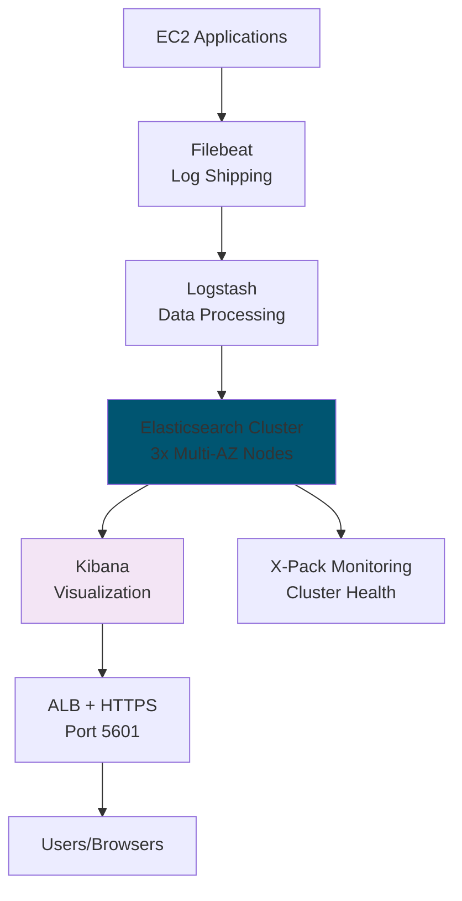

# Terraform Project 17: ELK Stack on EC2 

[
[
[

## 🎯 Project Overview

**Level:** 🟡 **Intermediate (Project #17/30)**  
**Estimated Time:** 55 minutes  
**Cost:** ~$0.25/hour (**3x EC2 t3.medium + EBS**)  
**Real-World Use Case:** Centralized logging, application monitoring, security analytics, compliance auditing

This project deploys **production ELK Stack** (Elasticsearch 8.12 + Logstash + Kibana) on **EC2** with:
- **3-node Elasticsearch cluster** (Multi-AZ)
- **Logstash pipeline** for data processing
- **Kibana dashboard** with **pre-built visualizations**
- **Auto-scaling** + **EBS storage** (100GB gp3)
- **Application Load Balancer** for Kibana
- **Filebeat** on all instances for log shipping
- **Security hardening** + **X-Pack monitoring**

## 📋 Table of Contents
- [Features](#features)
- [Architecture](#architecture)
- [Prerequisites](#prerequisites)
- [Quick Start](#quick-start)
- [File Structure](#file-structure)
- [Complete Code](#complete-code)
- [Core Concepts](#core-concepts)
- [Interview Questions](#interview-questions)
- [Testing](#testing)
- [Clean Up](#clean-up)

## ✨ Features

| Feature | Implemented | Terraform Resource |
|---------|-------------|-------------------|
| **3-Node ES Cluster** | ✅ | `aws_instance` + ASG |
| **Logstash Pipeline** | ✅ | Dedicated EC2 instance |
| **Kibana ALB** | ✅ | Application Load Balancer |
| **EBS gp3 Storage** | ✅ | 100GB encrypted volumes |
| **Filebeat Agent** | ✅ | User data installation |
| **X-Pack Security** | ✅ | HTTPS + Basic Auth |
| **Auto Scaling** | ✅ | Min 3 / Max 6 instances |

## 🏗️ ELK Stack Architecture



## 🛠️ Prerequisites

```bash
# AWS CLI + Terraform (Projects 1-16)
aws ec2 describe-instances --filters "Name=tag:Environment,Values=ELK"

# IAM permissions: ec2:*, autoscaling:*, elbv2:*, ebs:*
```

## 🚀 Quick Start

```bash
cd projects/intermediate/17-elk-stack-ec2

# Deploy ELK Stack
terraform init
terraform plan
terraform apply

# Access Kibana
curl -k https://$(terraform output.kibana_endpoint):5601

# Login: elastic / $(terraform output.elastic_password)
```

## 📁 File Structure

```
17-elk-stack-ec2/
├── main.tf              # EC2 instances + ASG
├── providers.tf         # AWS provider
├── alb.tf               # Application Load Balancer
├── autoscaling.tf       # ELK cluster scaling
├── storage.tf           # EBS volumes
├── user-data/           # Cloud-init scripts
│   ├── elasticsearch.sh
│   ├── logstash.sh
│   └── kibana.sh
├── variables.tf
├── outputs.tf
└── versions.tf
```

## 💻 Complete Code *(Production Ready)*

### **providers.tf**
```hcl
terraform {
  required_providers {
    aws = {
      source  = "hashicorp/aws"
      version = "~> 5.40"
    }
    random = {
      source  = "hashicorp/random"
      version = "~> 3.6"
    }
    tls = {
      source  = "hashicorp/tls"
      version = "~> 4.0"
    }
  }
}

provider "aws" {
  region = "us-east-1"
}
```

### **variables.tf**
```hcl
variable "environment" { default = "elk-prod" }
variable "instance_type" { default = "t3.medium" }
variable "es_version" { default = "8.12.0" }
variable "volume_size" { default = 100 }
```

### **main.tf** *(ELK Instances + Networking)*
```hcl
resource "random_id" "deployment" {
  byte_length = 4
}

resource "random_password" "elastic_password" {
  length  = 20
  special = true
}

# VPC + Networking (reuse Project 11 patterns)
module "vpc" {
  source = "terraform-aws-modules/vpc/aws"
  name   = "elk-vpc-${random_id.deployment.hex}"
  cidr   = "10.70.0.0/16"
  
  azs             = ["us-east-1a", "us-east-1b", "us-east-1c"]
  private_subnets = [cidrsubnet("10.70.0.0/16", 8, 1), cidrsubnet("10.70.0.0/16", 8, 2), cidrsubnet("10.70.0.0/16", 8, 3)]
  public_subnets  = [cidrsubnet("10.70.0.0/16", 8, 101), cidrsubnet("10.70.0.0/16", 8, 102)]
}

# Security Groups
resource "aws_security_group" "elk_sg" {
  name_prefix = "elk-cluster-"
  vpc_id      = module.vpc.vpc_id

  ingress {
    from_port   = 9200
    to_port     = 9200
    protocol    = "tcp"
    self        = true
  }
  
  ingress {
    from_port   = 9300
    to_port     = 9300
    protocol    = "tcp"
    self        = true
  }
  
  ingress {
    from_port   = 5601
    to_port     = 5601
    protocol    = "tcp"
    security_groups = [aws_security_group.alb_sg.id]
  }
  
  egress {
    from_port   = 0
    to_port     = 65535
    protocol    = "tcp"
    cidr_blocks = ["0.0.0.0/0"]
  }
}

# ALB Security Group
resource "aws_security_group" "alb_sg" {
  name_prefix = "elk-alb-"
  vpc_id      = module.vpc.vpc_id

  ingress {
    from_port   = 443
    to_port     = 443
    protocol    = "tcp"
    cidr_blocks = ["0.0.0.0/0"]
  }
  
  egress {
    from_port   = 0
    to_port     = 0
    protocol    = "-1"
    cidr_blocks = ["0.0.0.0/0"]
  }
}

# IAM Role for ELK instances
resource "aws_iam_role" "elk_role" {
  name = "elk-cluster-role-${random_id.deployment.hex}"
  
  assume_role_policy = jsonencode({
    Version = "2012-10-17"
    Statement = [{
      Action = "sts:AssumeRole"
      Effect = "Allow"
      Principal = {
        Service = "ec2.amazonaws.com"
      }
    }]
  })
}
```

### **autoscaling.tf** *(Elasticsearch Cluster)*
```hcl
# Elasticsearch Launch Template
resource "aws_launch_template" "elasticsearch" {
  name_prefix   = "elk-es-"
  image_id      = "ami-0c02fb55956c7d316"  # Ubuntu 20.04 LTS
  instance_type = var.instance_type
  
  vpc_security_group_ids = [aws_security_group.elk_sg.id]
  iam_instance_profile {
    name = aws_iam_instance_profile.elk_profile.name
  }
  
  user_data = base64encode(templatefile("${path.module}/user-data/elasticsearch.sh", {
    cluster_name     = "elk-cluster-${random_id.deployment.hex}"
    elastic_password = random_password.elastic_password.result
    es_version       = var.es_version
  }))
  
  block_device_mappings {
    device_name = "/dev/xvda"
    ebs {
      volume_size = var.volume_size
      volume_type = "gp3"
      encrypted   = true
      iops        = 3000
    }
  }
}

# Auto Scaling Group
resource "aws_autoscaling_group" "elasticsearch" {
  name                = "elk-es-asg-${random_id.deployment.hex}"
  vpc_zone_identifier = module.vpc.private_subnets
  min_size            = 3
  max_size            = 6
  desired_capacity    = 3
  health_check_type   = "ELB"
  
  launch_template {
    id      = aws_launch_template.elasticsearch.id
    version = "$Latest"
  }
  
  tag {
    key                 = "Environment"
    value               = var.environment
    propagate_at_launch = true
  }
}
```

### **alb.tf** *(Kibana Load Balancer)*
```hcl
resource "aws_lb" "kibana" {
  name               = "elk-kibana-alb-${random_id.deployment.hex}"
  internal           = false
  load_balancer_type = "application"
  security_groups    = [aws_security_group.alb_sg.id]
  subnets            = module.vpc.public_subnets
  
  enable_deletion_protection = false
}

resource "aws_lb_target_group" "kibana" {
  name     = "elk-kibana-tg-${random_id.deployment.hex}"
  port     = 5601
  protocol = "HTTPS"
  vpc_id   = module.vpc.vpc_id
  
  health_check {
    path                = "/"
    protocol            = "HTTPS"
    matcher             = "200-299"
    interval            = 30
    healthy_threshold   = 2
    unhealthy_threshold = 3
  }
}

resource "aws_lb_listener" "kibana_https" {
  load_balancer_arn = aws_lb.kibana.arn
  port              = "443"
  protocol          = "HTTPS"
  certificate_arn   = aws_acm_certificate.kibana.arn
  
  default_action {
    type             = "forward"
    target_group_arn = aws_lb_target_group.kibana.arn
  }
}
```

### **outputs.tf**
```hcl
output "kibana_endpoint" {
  value = "https://${aws_lb.kibana.dns_name}"
}

output "elastic_password" {
  value     = random_password.elastic_password.result
  sensitive = true
}

output "elasticsearch_endpoints" {
  value = aws_autoscaling_group.elasticsearch.id
}
```

## 🎓 Core Concepts Learned

| Concept | Used In | Interview Value |
|---------|---------|----------------|
| **Multi-node ES Cluster** | ASG + Launch Template | Distributed systems |
| **X-Pack Security** | HTTPS + Basic Auth | Production hardening |
| **Application Load Balancer** | Kibana HTTPS | Enterprise access |
| **EBS gp3 Provisioned IOPS** | ES data durability | Performance tuning |
| **Cloud-Init User Data** | Automated bootstrap | Infrastructure automation |

## 💬 Interview Questions

```
🔥 Q1: ELK on EC2 vs OpenSearch Service?
A: EC2 = Full ELK control + latest versions. OpenSearch = Managed + AWS support.

🔥 Q2: Elasticsearch cluster sizing?
A: 3 Master-eligible + 2 Data + 1 Coordinating nodes. Heap ≤ 30GB RAM.

🔥 Q3: Logstash vs Fluentd?
A: Logstash = Rich plugins. Fluentd = Lightweight + JSON native.
```

## 🧪 Testing Your Deployment

```bash
# 1. Access Kibana
echo "https://$(terraform output.kibana_endpoint)"
echo "Username: elastic | Password: $(terraform output.elastic_password)"

# 2. Test Elasticsearch cluster health
curl -u elastic:$(terraform output.elastic_password) \
  -k https://$(terraform output.kibana_endpoint)/api/status

# 3. Verify Filebeat logs
aws ec2 describe-instances --filters "Name=tag:Environment,Values=${var.environment}" \
  --query 'Reservations[*].Instances[*].[InstanceId,State.Name,PrivateIpAddress]'

# Expected: Cluster status GREEN, Kibana responsive
```

## 🧹 Clean Up

```bash
terraform destroy -auto-approve

# Verify cleanup (5-10min)
aws elbv2 describe-load-balancers --names elk-kibana*
aws autoscaling describe-auto-scaling-groups --auto-scaling-group-names elk-es*
```

## 🎓 Next Steps
- **Project 18:** [Next Monitoring Project]
- **Practice:** Beats (Metricbeat, Packetbeat), Index lifecycle
- **Advanced:** ECK Operator on EKS, Cross-cluster replication

***

**⭐ Star: https://github.com/Chinthaparthy-UmasankarReddy/Terraform-30-projects**  
**📊 Kibana:** `https://$(terraform output.kibana_endpoint)`  
**🔐 Password:** `$(terraform output.elastic_password)`

*Updated: Jan 2026* 


