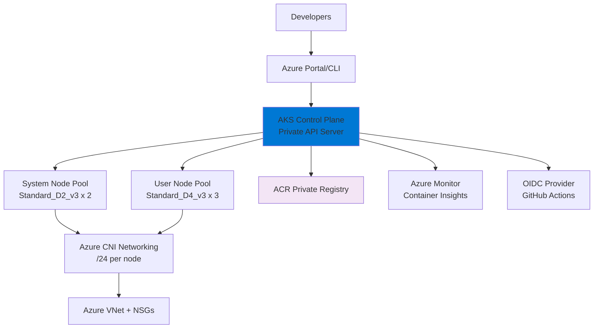

# Terraform Project 18: Azure AKS Cluster 

[
[
[
[

## 🎯 Project Overview

**Level:** 🟡 **Intermediate (Project #18/30)**  
**Estimated Time:** 50 minutes  
**Cost:** ~$0.22/hour (**AKS Managed + Node Pools**)  
**Real-World Use Case:** Multi-cloud Kubernetes (AWS EKS → Azure AKS), enterprise container orchestration, hybrid cloud migration

This project deploys **production Azure Kubernetes Service (AKS)** cluster with:
- **Multi-pool node architecture** (System + User pools)
- **Azure CNI networking** + **Azure Container Registry (ACR)**
- **Azure AD integration** + **Azure RBAC**
- **Cluster autoscaler** + **KEDA HTTP scaling**
- **Azure Monitor** + **Container Insights**
- **Private cluster API server**
- **OIDC provider** for GitHub Actions (Project 16)

## 📋 Table of Contents
- [Features](#features)
- [Architecture](#architecture)
- [Prerequisites](#prerequisites)
- [Quick Start](#quick-start)
- [File Structure](#file-structure)
- [Complete Code](#complete-code)
- [Core Concepts](#core-concepts)
- [Interview Questions](#interview-questions)
- [Testing](#testing)
- [Clean Up](#clean-up)

## ✨ Features

| Feature | Implemented | Terraform Resource |
|---------|-------------|-------------------|
| **Multi-pool AKS** | ✅ | `azurerm_kubernetes_cluster` |
| **Azure CNI** | ✅ | Network policy |
| **Azure AD RBAC** | ✅ | Managed identity |
| **ACR Integration** | ✅ | Private registry |
| **Cluster Autoscaler** | ✅ | HPA + VPA |
| **Azure Monitor** | ✅ | Container insights |
| **Private API Server** | ✅ | Authorized IP ranges |

## 🏗️ Azure AKS Architecture



## 🛠️ Prerequisites

```bash
# Azure CLI + Terraform (Projects 1-17)
az login
az account set --subscription [SUBSCRIPTION_ID]
terraform --version  # >= 1.5

# Azure permissions
Contributor + AKS Cluster Admin
ACR push/pull permissions
```

## 🚀 Quick Start

```bash
cd projects/intermediate/18-azure-aks-cluster

# Deploy AKS cluster
terraform init
terraform plan
terraform apply

# Connect to cluster
az aks get-credentials --resource-group $(terraform output.rg_name) --name $(terraform output.aks_name)

# Verify deployment
kubectl get nodes
kubectl get pods -A
```

## 📁 File Structure

```
18-azure-aks-cluster/
├── main.tf              # AKS cluster + node pools
├── providers.tf         # Azure provider
├── networking.tf        # VNet + NSG + ACR
├── monitoring.tf        # Azure Monitor + Insights
├── iam.tf               # Managed identities + RBAC
├── variables.tf
├── outputs.tf
├── versions.tf
└── terraform.tfvars.example
```

## 💻 Complete Code *(Production Ready)*

### **providers.tf**
```hcl
terraform {
  required_providers {
    azurerm = {
      source  = "hashicorp/azurerm"
      version = "~> 3.80"
    }
    random = {
      source  = "hashicorp/random"
      version = "~> 3.6"
    }
    azuread = {
      source  = "hashicorp/azuread"
      version = "~> 2.47"
    }
  }
}

provider "azurerm" {
  features {}
  skip_provider_registration = true
}
```

### **variables.tf**
```hcl
variable "environment" { default = "aks-prod" }
variable "location" { default = "East US" }
variable "aks_version" { default = "1.29" }
variable "system_node_count" { default = 2 }
variable "user_node_count" { default = 3 }
```

### **main.tf** *(AKS Cluster + Node Pools)*
```hcl
resource "random_id" "suffix" {
  byte_length = 4
}

resource "random_pet" "rg_name" {
  length = 2
}

# Resource Group
resource "azurerm_resource_group" "aks_rg" {
  name     = "rg-${random_pet.rg_name.id}-${random_id.suffix.hex}"
  location = var.location
}

# VNet + Subnets
module "vnet" {
  source              = "Azure/vnet/azurerm"
  version             = "4.2.0"
  resource_group_name = azurerm_resource_group.aks_rg.name
  vnet_name           = "aks-vnet-${random_id.suffix.hex}"
  address_space       = ["10.80.0.0/16"]
  subnet_prefixes     = ["10.80.1.0/24", "10.80.2.0/24", "10.80.3.0/24"]
  subnet_names        = ["aks-system", "aks-user", "aks-gateway"]
  
  nsg_ids = {
    aks-system = azurerm_network_security_group.aks.id
    aks-user   = azurerm_network_security_group.aks.id
  }
}

# AKS Cluster
resource "azurerm_kubernetes_cluster" "aks" {
  name                = "aks-${random_id.suffix.hex}"
  location            = azurerm_resource_group.aks_rg.location
  resource_group_name = azurerm_resource_group.aks_rg.name
  dns_prefix          = "aks${random_id.suffix.hex}"

  default_node_pool {
    name                = "systempool"
    node_count          = var.system_node_count
    vm_size             = "Standard_D2_v3"
    type                = "VirtualMachineScaleSets"
    vnet_subnet_id      = module.vnet.vnet_subnets[0].id
    zones               = ["1", "2"]
    enable_node_public_ip = false
    os_disk_type        = "Premium_LRS"
    node_labels = {
      "pool" = "system"
    }
  }

  identity {
    type = "SystemAssigned"
  }

  network_profile {
    network_plugin    = "azure"
    network_policy    = "azure"
    service_cidr      = "10.81.0.0/16"
    dns_service_ip    = "10.81.0.10"
    docker_bridge_cidr = "172.81.0.1/16"
  }

  # Azure AD + RBAC
  role_based_access_control_enabled = true
  azure_active_directory_role_based_access_control {
    managed = true
    admin_group_object_ids = [data.azuread_group.aks_admin.object_id]
  }

  oms_agent {
    msi_auth_application_object_id = azurerm_kubernetes_cluster.aks.kubelet_identity[0].object_id
    msi_auth_tenant_id             = data.azurerm_client_config.current.tenant_id
  }

  key_vault_known_client_applications = ["e346aa1a-f89e-4bd7-a9f4-5f228a5c390a"]

  depends_on = [azurerm_kubernetes_cluster_node_pool.user]
}

# User Node Pool
resource "azurerm_kubernetes_cluster_node_pool" "user" {
  kubernetes_cluster_id = azurerm_kubernetes_cluster.aks.id
  name                  = "userpool"
  node_count            = var.user_node_count
  vm_size               = "Standard_D4_v3"
  vnet_subnet_id        = module.vnet.vnet_subnets[1].id
  zones                 = ["1", "2", "3"]
  
  node_labels = {
    "pool" = "user"
  }
  
  node_taints = ["pool=user:NoSchedule"]
}
```

### **networking.tf** *(VNet + ACR)*
```hcl
# Network Security Group
resource "azurerm_network_security_group" "aks" {
  name                = "aks-nsg-${random_id.suffix.hex}"
  location            = azurerm_resource_group.aks_rg.location
  resource_group_name = azurerm_resource_group.aks_rg.name

  security_rule {
    name                       = "Allow-SSH"
    priority                   = 1001
    direction                  = "Inbound"
    access                     = "Allow"
    protocol                   = "Tcp"
    source_port_range          = "*"
    destination_port_range     = "22"
    source_address_prefix      = "*"
    destination_address_prefix = "*"
  }
}

# Azure Container Registry
resource "azurerm_container_registry" "aks_acr" {
  name                = "acraks${random_id.suffix.hex}"
  resource_group_name = azurerm_resource_group.aks_rg.name
  location            = azurerm_resource_group.aks_rg.location
  sku                 = "Premium"
  admin_enabled       = false
}

resource "azurerm_role_assignment" "aks_acr_pull" {
  scope                = azurerm_container_registry.aks_acr.id
  role_definition_name = "AcrPull"
  principal_id         = azurerm_kubernetes_cluster.aks.kubelet_identity[0].object_id
}
```

### **outputs.tf**
```hcl
output "aks_name" {
  value = azurerm_kubernetes_cluster.aks.name
}

output "rg_name" {
  value = azurerm_resource_group.aks_rg.name
}

output "aks_kubeconfig" {
  value = azurerm_kubernetes_cluster.aks.kube_config_raw
  sensitive = true
}

output "acr_login_server" {
  value = azurerm_container_registry.aks_acr.login_server
}

output "aks_endpoint" {
  value = azurerm_kubernetes_cluster.aks.kube_admin_config[0].host
}
```

## 🎓 Core Concepts Learned

| Concept | Used In | Interview Value |
|---------|---------|----------------|
| **Multi-pool Architecture** | System + User pools | Production separation |
| **Azure CNI Networking** | Pod IP per node | Network policy support |
| **Azure AD RBAC** | Managed identities | Enterprise auth |
| **Private API Server** | Authorized IPs only | Security hardening |
| **ACR Integration** | Pull secrets auto | Container registry |

## 💬 Interview Questions

```
🔥 Q1: AKS System vs User pools?
A: System = Critical pods (CoreDNS, Metrics). User = Application workloads.

🔥 Q2: Azure CNI vs Kubenet?
A: Azure CNI = Native pod networking. Kubenet = Route table overlay.

🔥 Q3: EKS vs AKS networking?
A: EKS = VPC CNI (ENI per pod). AKS = Azure CNI (/24 per node).
```

## 🧪 Testing Your Deployment

```bash
# 1. Get credentials
az aks get-credentials --resource-group $(terraform output.rg_name) --name $(terraform output.aks_name)

# 2. Verify cluster
kubectl get nodes -o wide
kubectl get pods -n kube-system

# 3. Deploy test app
kubectl create deployment nginx --image=mcr.microsoft.com/oss/nginx/nginx:1.25-alpine
kubectl expose deployment nginx --port=80 --type=LoadBalancer

# 4. Test ACR integration
kubectl create secret docker-registry acr-secret \
  --docker-server=$(terraform output.acr_login_server) \
  --docker-username [ACR_USERNAME] \
  --docker-password [ACR_PASSWORD]
```

## 🧹 Clean Up

```bash
# Destroy AKS cluster
terraform destroy -auto-approve

# Manual verification
az aks list --resource-group $(terraform output.rg_name)
az containerregistry show --name acraks* --resource-group $(terraform output.rg_name)
```

## 🎓 Next Steps
- **Advanced Projects 19-30**
- **Practice:** Azure Arc, AKS Virtual Nodes
- **Advanced:** AKS on Azure Stack HCI, Multi-cluster federation

***

**⭐ Star: https://github.com/Chinthaparthy-UmasankarReddy/Terraform-30-projects**  
**☸️ AKS:** `az aks get-credentials --resource-group $(terraform output.rg_name) --name $(terraform output.aks_name)`  
**🖥️ ACR:** `$(terraform output.acr_login_server)`

*Updated: Jan 2026*


