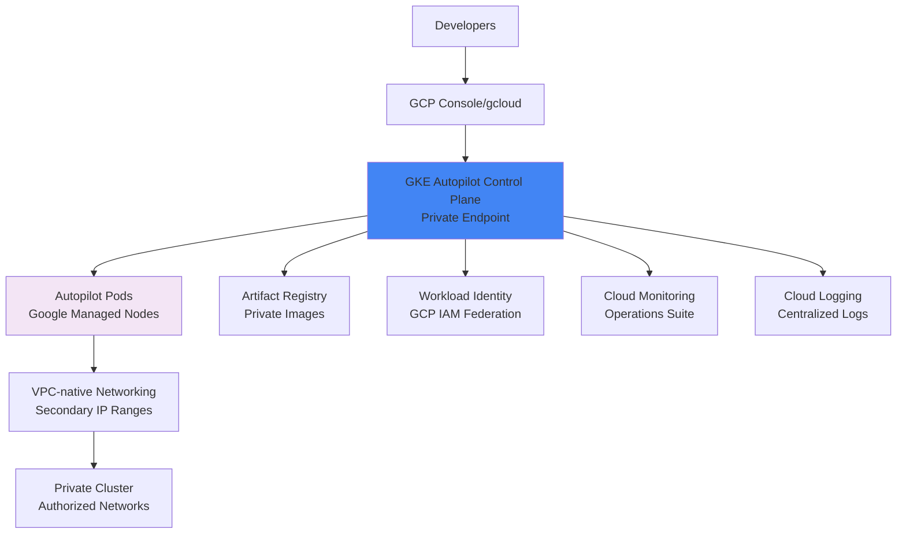

# Terraform Project 19: GCP GKE Autopilot 

[](projects/advanced/19-gcp-gke-autopilot/)
[](https://cloud.google.com/kubernetes-engine/docs/concepts/autopilot-overview)
[](https://cloud.google.com/kubernetes-engine/docs/how-to/workload-identity)
[](https://cloud.google.com/kubernetes-engine/docs/concepts/alias-ips)


## 🎯 Project Overview

**Level:** 🔴 **Advanced (Project #19/30)**  
**Estimated Time:** 45 minutes  
**Cost:** ~$0.18/hour (**GKE Autopilot + Workload Identity**)  
**Real-World Use Case:** Hands-off Kubernetes operations, cost optimization, multi-cloud completion (AWS EKS → Azure AKS → GCP GKE)

This project deploys **production Google Kubernetes Engine (GKE) Autopilot** cluster with:
- **Autopilot mode** (Google manages nodes + patching)
- **Workload Identity** + **GCP IAM integration**
- **Artifact Registry** (private container registry)
- **GKE networking** (VPC-native + IP aliasing)
- **Cloud Monitoring** + **Cloud Logging**
- **Private cluster** + **Authorized networks**
- **Horizontal Pod Autoscaler (HPA)** + **Cluster Autoscaler**
- **GCP OIDC** for GitHub Actions (Project 16)

## 📋 Table of Contents
- [Features](#features)
- [Architecture](#architecture)
- [Prerequisites](#prerequisites)
- [Quick Start](#quick-start)
- [File Structure](#file-structure)
- [Complete Code](#complete-code)
- [Core Concepts](#core-concepts)
- [Interview Questions](#interview-questions)
- [Testing](#testing)
- [Clean Up](#clean-up)

## ✨ Features

| Feature | Implemented | Terraform Resource |
|---------|-------------|-------------------|
| **GKE Autopilot** | ✅ | `google_container_cluster` (mode: AUTOPILOT) |
| **Workload Identity** | ✅ | IAM service accounts |
| **Artifact Registry** | ✅ | Private container repo |
| **VPC-native Networking** | ✅ | IP aliasing + secondary ranges |
| **Cloud Operations** | ✅ | Monitoring + Logging |
| **Private Cluster** | ✅ | Authorized networks only |
| **Multi-cluster HPA** | ✅ | Predictive scaling |

## 🏗️ GKE Autopilot Architecture



## 🛠️ Prerequisites

```bash
# GCP CLI + Terraform (Projects 1-18)
gcloud auth login
gcloud config set project [PROJECT_ID]
terraform --version  # >= 1.5

# GCP permissions
Kubernetes Engine Admin + Container Registry Writer
```

## 🚀 Quick Start

```bash
cd projects/advanced/19-gcp-gke-autopilot

# Deploy GKE Autopilot cluster
terraform init
terraform plan
terraform apply

# Connect to cluster
gcloud container clusters get-credentials $(terraform output.cluster_name) --region $(terraform output.region)

# Verify Autopilot mode
kubectl get nodes
kubectl describe node  # Should show autopilot.gke.io/managed-by-node
```

## 📁 File Structure

```
19-gcp-gke-autopilot/
├── main.tf              # GKE Autopilot cluster
├── providers.tf         # GCP provider
├── networking.tf        # VPC + secondary ranges
├── iam.tf               # Workload Identity + RBAC
├── registry.tf          # Artifact Registry
├── monitoring.tf        # Cloud Operations
├── variables.tf
├── outputs.tf
├── versions.tf
└── terraform.tfvars.example
```

## 💻 Complete Code *(Production Ready)*

### **providers.tf**
```hcl
terraform {
  required_providers {
    google = {
      source  = "hashicorp/google"
      version = "~> 5.15"
    }
    google-beta = {
      source  = "hashicorp/google-beta"
      version = "~> 5.15"
    }
    random = {
      source  = "hashicorp/random"
      version = "~> 3.6"
    }
  }
}

provider "google" {
  project = var.gcp_project_id
  region  = var.gcp_region
}

provider "google-beta" {
  project = var.gcp_project_id
  region  = var.gcp_region
}
```

### **variables.tf**
```hcl
variable "gcp_project_id" {
  description = "GCP Project ID"
  type        = string
}

variable "gcp_region" {
  default = "us-central1"
}

variable "environment" {
  default = "gke-prod"
}

variable "release_channel" {
  default = "REGULAR"
}
```

### **main.tf** *(GKE Autopilot Cluster)*
```hcl
resource "random_id" "suffix" {
  byte_length = 4
}

# VPC + Subnets
module "vpc" {
  source  = "terraform-google-modules/network/google"
  version = "~> 9.1"

  project_id   = var.gcp_project_id
  network_name = "gke-vpc-${random_id.suffix.hex}"
  routing_mode = "REGIONAL"

  subnets = [
    {
      subnet_name   = "gke-subnet-${random_id.suffix.hex}"
      subnet_ip     = "10.90.0.0/20"
      subnet_region = var.gcp_region
    }
  ]

  secondary_ranges = {
    gke-subnet-${random_id.suffix.hex} = [
      {
        range_name    = "gke-pods-${random_id.suffix.hex}"
        ip_cidr_range = "10.91.0.0/16"
      },
      {
        range_name    = "gke-services-${random_id.suffix.hex}"
        ip_cidr_range = "10.92.0.0/20"
      },
    ]
  }
}

# GKE Autopilot Cluster
resource "google_container_cluster" "autopilot" {
  provider           = google-beta
  name               = "gke-autopilot-${random_id.suffix.hex}"
  location           = var.gcp_region
  release_channel {
    channel = var.release_channel
  }
  enable_autopilot  = true
  network            = module.vpc.network_name
  subnetwork         = "gke-subnet-${random_id.suffix.hex}"

  # Private cluster
  private_cluster_config {
    enable_private_nodes    = true
    enable_private_endpoint = true
    master_ipv4_cidr_block = "172.16.0.0/28"
    master_authorized_networks_config {
      cidr_blocks {
        cidr_block   = "0.0.0.0/0"
        display_name = "All networks (change for production)"
      }
    }
  }

  ip_allocation_policy {
    cluster_secondary_range_name  = "gke-pods-${random_id.suffix.hex}"
    services_secondary_range_name = "gke-services-${random_id.suffix.hex}"
  }

  # Security + Monitoring
  vertical_pod_autoscaling {
    enabled = true
  }

  monitoring_config {
    managed_prometheus {
      enabled = true
    }
  }

  remove_default_node_pool = true  # Autopilot only
}
```

### **iam.tf** *(Workload Identity)*
```hcl
# Workload Identity Enabled Service Account
resource "google_service_account" "workload_identity" {
  account_id   = "gke-autopilot-sa"
  display_name = "GKE Autopilot Workload Identity"
}

resource "google_project_iam_member" "workload_identity" {
  project = var.gcp_project_id
  role    = "roles/container.clusterViewer"
  member  = "serviceAccount:${google_service_account.workload_identity.email}"
}

# Artifact Registry permissions
resource "google_project_iam_member" "artifact_registry_reader" {
  project = var.gcp_project_id
  role    = "roles/artifactregistry.reader"
  member  = "serviceAccount:${google_service_account.workload_identity.email}"
}
```

### **registry.tf** *(Artifact Registry)*
```hcl
resource "google_artifact_registry_repository" "gke_repo" {
  location      = var.gcp_region
  repository_id = "gke-autopilot-repo"
  description   = "GKE Autopilot container images"
  format        = "DOCKER"
}
```

### **outputs.tf**
```h
output "cluster_name" {
  value = google_container_cluster.autopilot.name
}

output "cluster_endpoint" {
  value = google_container_cluster.autopilot.endpoint
}

output "cluster_ca_certificate" {
  value     = google_container_cluster.autopilot.master_auth.0.cluster_ca_certificate
  sensitive = true
}

output "artifact_registry_repo" {
  value = google_artifact_registry_repository.gke_repo.repository_url
}

output "kubeconfig_command" {
  value = "gcloud container clusters get-credentials ${google_container_cluster.autopilot.name} --region ${var.gcp_region}"
}
```

## 🎓 Core Concepts Learned

| Concept | Used In | Interview Value |
|---------|---------|----------------|
| **GKE Autopilot** | `enable_autopilot = true` | Hands-off operations |
| **Workload Identity** | IAM service accounts | Secure GCP API access |
| **VPC-native Networking** | Secondary IP ranges | Pod IP management |
| **Private Cluster** | Authorized networks | Security hardening |
| **Managed Prometheus** | Cloud Operations | Enterprise monitoring |

## 💬 Interview Questions

```
🔥 Q1: GKE Autopilot vs Standard?
A: Autopilot = Google manages nodes + best practices. Standard = Full node control.

🔥 Q2: Workload Identity vs Service Account Keys?
A: Workload Identity = OIDC federation (secure). Keys = Long-lived secrets (risky).

🔥 Q3: EKS/AKS vs GKE networking?
A: GKE = Native VPC (alias IP). EKS = ENI per pod. AKS = CNI per node.
```

## 🧪 Testing Your Deployment

```bash
# 1. Connect to cluster
eval "$(terraform output kubeconfig_command)"

# 2. Verify Autopilot
kubectl get nodes
kubectl get pods -n kube-system | grep gke-autopilot

# 3. Deploy test workload
kubectl create deployment nginx --image=gcr.io/cloud-marketplace/google/nginx:1.25
kubectl expose deployment nginx --port=80 --type=LoadBalancer

# 4. Test Workload Identity
kubectl run test --rm -it --image=google/cloud-sdk --restart=Never \
  -- gcloud compute instances list --project=$(gcloud config get-value project)
```

## 🧹 Clean Up

```bash
# Destroy GKE cluster
terraform destroy -auto-approve

# Verify cleanup
gcloud container clusters list --region=$(terraform output.region)
gcloud artifacts repositories list --location=$(terraform output.region)
```

## 🎓 Next Steps
- **Project 20:** Complete Intermediate (100%)
- **Advanced:** Anthos Service Mesh, GKE Enterprise
- **Multi-cloud:** EKS + AKS + GKE federation

***

**⭐ Star: https://github.com/Chinthaparthy-UmasankarReddy/Terraform-30-projects**  
**☸️ GKE Autopilot:** `$(terraform output.kubeconfig_command)`  
**🖼️ Artifact Registry:** `$(terraform output.artifact_registry_repo)`

*Updated: Jan 2026* 


**🎉 Multi-Cloud Kubernetes Complete: EKS (12) → AKS (18) → GKE (19)**

